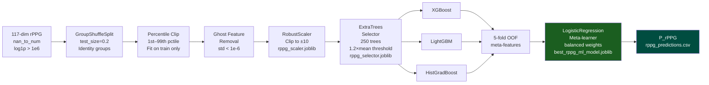

<div align="center">

# 🧬 Model 1 — rPPG Physiological Deepfake Detection

<p>
  
  
  
  
  
</p>

**FakeCatcher-inspired remote photoplethysmography (rPPG) stream that detects biological signal inconsistencies impossible to fabricate in synthesised video.**

</div>

---

## 📋 Table of Contents

- [Scientific Rationale](#-scientific-rationale)
- [Architecture Overview](#-architecture-overview)
- [Pipeline Flowchart](#-pipeline-flowchart)
- [Environment & Dependencies](#-environment--dependencies)
- [Dataset Configuration](#-dataset-configuration)
- [9 Facial ROI Regions](#-9-facial-roi-regions)
- [117-Dimensional Feature Vector](#-117-dimensional-feature-vector)
- [CHROM rPPG Signal Processing](#-chrom-rppg-signal-processing)
- [ML Pipeline v7.2 — Stacking Ensemble](#-ml-pipeline-v72--stacking-ensemble)
- [Optional Deep Learning Section](#-optional-deep-learning-section)
- [Hyperparameter Reference](#-hyperparameter-reference)
- [Output Files](#-output-files)
- [Execution Order](#-execution-order)
- [Session Resumption](#-session-resumption)

---

## 🔬 Scientific Rationale

Deepfake generators synthesise pixel-level appearance — they cannot replicate the spatially coherent **blood-volume-pulse (BVP) signals** that propagate across real human skin. The cardiac pulse produces subtle, periodic colour changes measurable in the red, green, and blue channels of any standard camera. These changes must be:

- **Spatially coherent** — forehead, cheeks, chin, and jaw all pulsate at the same fundamental frequency
- **Temporally consistent** — HRV metrics (RMSSD, SDNN, pNN50) reflect genuine autonomic nervous system variation
- **Phase-synchronised** — cross-ROI phase relationships are fixed by the speed of pulse-wave propagation

Deepfake videos fail all three criteria simultaneously. This model quantifies 117 dimensions of these failures and trains a gradient-boosted stacking ensemble to discriminate authentic from synthetic physiological patterns.

> **Reference:** Üstunet et al., *FakeCatcher: Detection of Synthetic Portrait Videos using Biological Signals*, IEEE TPAMI 2023.

---

## 🏗️ Architecture Overview

| Property | Value |
|----------|-------|
| Face landmark model | MediaPipe FaceMesh — 468 landmarks, `static_image_mode=False` |
| Primary rPPG algorithm | CHROM (de Haan & Jeanne, 2013) |
| Alternative algorithms | GREEN, POS (overlap-add) |
| ROI regions | 9 anatomically defined facial zones |
| Feature dimensions | 117 physiological + geometric features |
| Primary classifier | Stacking Ensemble: XGBoost + LightGBM + HistGradBoost → Logistic Regression |
| Optional deep learning | 8 DL architectures (gated behind `SKIP_DL_SECTION = True`) |
| Max frames per video | 60 (`np.linspace` uniform sampling) |
| Session guard | 8.5-hour Kaggle limit enforced |
| Output file | `rppg_predictions.csv` — column `P_rPPG` |

---

## 🗺️ Pipeline Flowchart

```mermaid
flowchart TD
    A["🎬 Input Video\n.mp4 / .avi / .mov / .mkv / .webm\nmax 60 frames — np.linspace uniform sampling\nFPS auto-detected — fallback 30.0 if invalid\nMissing paths verified before pipeline starts"]

    A --> B["Preflight Check — 42 items across 4 phases\nPhase 1: P100 GPU compatibility — install PyTorch 2.4.1+cu121 if needed\nPhase 2: mediapipe==0.10.14 WITH full deps — protobuf/flatbuffers required\nPhase 3: Import validation — numpy pandas scipy sklearn xgboost lightgbm cv2\nPhase 4: Paths — /kaggle/working writable disk space > 5GB Python version"]

    B --> C["Unified Data Compiler Cell 7\nCreates master_dataset_index.csv shared by all 4 models\nrandom.seed 42 — identical split across all notebooks\nMax 200 videos per source — P100 RAM-safe budget\nMissing path verification — remove before saving\nResets real_files_with_paths and fake_files_with_paths lists"]

    C --> D["MediaPipe FaceMesh Initialisation\nNativeMediaPipeExtractor class — Cell 4\nstatic_image_mode=False — temporal tracking enabled\nmax_num_faces=1 — largest face only\nrefine_landmarks=False — faster inference\nmin_detection_confidence=0.5\nmin_tracking_confidence=0.5\n_last_points cache — fallback on detection failure"]

    D --> E{"Pre-extracted features\navailable at\nPOSSIBLE_PATHS?"}

    E -- Yes --> F["Load from checkpoint\nPrimary: incremental_checkpoint.npz\nFallback: features_checkpoint.npy + labels_checkpoint.npy + paths_checkpoint.npy\nConvert to float64 and int64\nQuality check — nan_to_num posinf → 1e6"]

    E -- No --> G["Per-Video Feature Extraction\nFor each video in combined real + fake list\nSkip already_processed paths — set lookup O(1)\nCall process_video path method=CHROM max_frames=60\nTime guard: abort if elapsed > 8.5 hours\nINCREMENTAL SAVE every 5 videos to incremental_checkpoint.npz\nAlso save .npy individual files for Kaggle dataset upload"]

    G --> F

    F --> H["For each frame — extract 9 ROI RGB means\ncv2.convexHull on landmark subset\ncv2.fillConvexPoly → binary mask uint8\ncv2.mean on BGR frame → RGB mean tuple\nBGR to RGB channel swap in mean extraction\nFACE_DETECTION_INTERVAL = 1 — run FaceMesh every sampled frame\nRationale: linspace gaps can be 0.5-2s so reusing prior landmarks gives wrong positions"]

    H --> I["9 ROI Regions\nForehead 36 landmarks\nLeft Cheek 15 landmarks\nRight Cheek 15 landmarks\nLeft Forehead 11 landmarks\nRight Forehead 11 landmarks\nChin 12 landmarks\nNose 12 landmarks\nLeft Jaw 11 landmarks\nRight Jaw 11 landmarks"]

    I --> J["CHROM rPPG Signal Processing\nWindow size = max(int(1.6 * fps), 2)\nStep = max(1, window // 2) — 50% overlap\nPer-window mean normalisation of R G B\nxs = 3R - 2G  ys = 1.5R + G - 1.5B\nalpha = clip(std_xs / std_ys, 0, 10)\npulse = xs - alpha × ys\nOverlap-add accumulation across windows\nLinear detrend via scipy.signal.detrend\nBandpass: Butterworth 3rd-order 0.7–4.0 Hz\nNaN interpolation: linear for < 30% missing\nZero-fill if ≥ 30% missing for that ROI"]

    J --> K["117-Feature Extraction — Cell 8\nWelch PSD: nperseg=min(256, T//2) nfft=1024\nBug fix: N_RPPG_ACTUAL=117 hardcoded\nFEATURE_NAMES may have fewer due to coherence removal\nbut saved .npy files always have 117 columns"]

    K --> K1["Spectral 24 features\nForehead + Left Cheek each get 12:\nSNR · Spectral Purity · Peak Prominence\nDominant Freq · Harmonic Ratio · Entropy\nCentroid · MAD · STD · ZCR · Kurtosis · Skewness"]

    K --> K2["HRV 8 features\nRMSSD · SDNN · pNN50 · pNN20\nLF Power 0.04-0.15 Hz\nHF Power 0.15-0.40 Hz\nLF/HF Ratio · Total Power"]

    K --> K3["Cross-ROI Correlation 12 features\nPearson: fh-lc fh-rc lc-rc fh-chin\nfh-nose chin-nose lc-chin rc-chin\nlc-nose rc-nose lf-rf lj-rj"]

    K --> K4["Spectral Coherence up to 6 features\ncoherence_fh_lc fh_rc lc_rc\nfh_chin chin_nose lj_rj\nDropped post-extraction if zero variance\nBug: single-segment nperseg gives coherence=1.0 always"]

    K --> K5["Phase 2 + BPM 5 features\nphase_diff_fh_lc fh_rc\nbpm_estimate signal_stationarity\nbpm_consistency"]

    K --> K6["HRV signal quality 5 features\nsignal_energy signal_entropy\nspectral_flatness crest_factor\nsignal_complexity"]

    K --> K7["Geometry 26 features\nEye distance and width height aspect ratios\nNose mouth jaw symmetry ratios\nFace aspect forehead width\nUpper middle lower face ratios\nCheek symmetry · overall mean std"]

    K --> K8["Extended correlations + bands 9+12 features\nBand power low mid high for fh and lc\nBand ratio + variance\nbpm/snr stats across 9 regions\nPhase sync PLV mean std consistency\nRGB channel corr green-red green-blue\nSkin reflection HSV variance · specular score"]

    K1 & K2 & K3 & K4 & K5 & K6 & K7 & K8 --> L

    L["N_RPPG_ACTUAL = 117\nnan_to_num nan→0.0 posinf→40.0 neginf→-40.0\nStored as float64 numpy array"]

    L --> M["Optional: EfficientNet-B0 Supplementary Features Cell 25\nEXTRACT_FACE_FEATURES = True\ntimm efficientnet_b0 pretrained 1280-dim\n10 frames uniformly sampled\nFace crop via MediaPipe bbox + 20% padding\n224×224 ImageNet normalised\nmean_feat concat std_feat = 2560-dim\nCheckpoint every 50 videos\nTime guard 10.5h limit"]

    L --> N["Optional: FFT + DCT + Geometry Features Cell 26\nExtract FFT radial profile 32 features per image\nExtract DCT sorted coefficients + stats 32 features\n26 geometry features from LANDMARK_PAIRS dict\nCombined as all_features array"]

    M & N --> O["Feature Matrix Assembly\nIsolation: rppg_part = X[:, :117] always\nIf n_features > N_RPPG_ACTUAL + 2560:\n  also append freq_geo_part\nElse use rppg_part only\nBug fix: hardcode 117 not len(FEATURE_NAMES)"]

    O --> P["ML Pipeline v7.2 Cell 27\nSEED = 42 throughout"]

    P --> P1["Step 1 — Sanitisation\nnan_to_num nan→0 posinf→1e9 neginf→-1e9\nlog1p applied to values > 1e6\nVideo IDs from os.path.basename(paths_array)"]

    P --> P2["Step 2 — Identity-Aware Split 80/20\nGroupShuffleSplit n_splits=1 test_size=0.2 seed=42\nGroups via regex: FF r^(\\d+)_ Celeb r^(id\\d+)_\nPercentile clip p1-p99 fitted on train only\nGhost feature removal std < 1e-6 on X_train"]

    P --> P3["Step 3 — RobustScaler\nFit on X_train only\nClip scaled values to -10 +10\nSaved: rppg_scaler.joblib"]

    P --> P4["Step 4 — ExtraTrees Feature Selector\nn_estimators=250 max_depth=None seed=42\nSelectFromModel threshold=1.2*mean\nFallback to mean if < 10 features selected\nSaved: rppg_selector.joblib"]

    P --> P5["Step 5 — Class Weights\nscale_pos_weight = n_real / n_fake\nApplied to XGBoost and LightGBM"]

    P1 & P2 & P3 & P4 & P5 --> Q

    Q["Stacking Ensemble Training\nStackingClassifier cv=5 passthrough=False n_jobs=1"]

    Q --> Q1["XGBoost Base\nn_estimators=300 max_depth=3\nlearning_rate=0.02 subsample=0.8\ncolsample_bytree=0.8 reg_lambda=10.0\nreg_alpha=1.0 scale_pos_weight=n_real/n_fake\nuse_label_encoder=False eval_metric=logloss"]

    Q --> Q2["LightGBM Base\nn_estimators=300 max_depth=3\nlearning_rate=0.02 num_leaves=8\nsubsample=0.8 colsample_bytree=0.8\nreg_lambda=10.0 reg_alpha=1.0\nclass_weight=balanced verbose=-1"]

    Q --> Q3["HistGradBoostingClassifier Base\nmax_iter=300 max_depth=5\nlearning_rate=0.02 l2_regularization=5.0\nmax_leaf_nodes=15 class_weight=balanced"]

    Q1 & Q2 & Q3 --> Q4["Meta-Learner LogisticRegression\nclass_weight=balanced max_iter=1000 C=1.0\n5-fold OOF cross_val_predict as meta-features\nrandom_state=42"]

    Q4 --> R["Evaluation\nAUC-ROC · Accuracy · F1\nclassification_report digits=4\nSaved: best_rppg_ml_model.joblib"]

    R --> S["rPPG Predictions Export\nP_rPPG = best_model.predict_proba(X_final)[:, 1]\nvideo_filenames from os.path.basename(paths_array)\nFallback: generic video_{i:04d} if paths_array missing"]

    S --> T["OUTPUT\nrppg_predictions.csv\nColumns: video_id · label · P_rPPG\nP_rPPG in range 0 to 1\nmodel_outputs.zip archive via shutil.make_archive"]

    style A fill:#e0f2f1,stroke:#00695c,color:#004d40
    style B fill:#b2dfdb,stroke:#00695c,color:#004d40
    style C fill:#c8e6c9,stroke:#388e3c,color:#1b5e20
    style D fill:#a5d6a7,stroke:#388e3c,color:#1b5e20
    style J fill:#81c784,stroke:#388e3c,color:#1b5e20
    style L fill:#66bb6a,stroke:#2e7d32,color:#fff
    style Q fill:#388e3c,stroke:#1b5e20,color:#fff
    style Q4 fill:#1b5e20,stroke:#003300,color:#fff
    style T fill:#004d40,stroke:#003300,color:#fff
```



---

## ⚙️ Environment & Dependencies

| Package | Version | Purpose |
|---------|---------|---------|
| `torch` | 2.4.1+cu121 | P100 (SM 6.0) compatible PyTorch |
| `mediapipe` | 0.10.14 | FaceMesh 468-landmark extraction |
| `facenet-pytorch` | 2.6.0 | MTCNN (imported but not used for rPPG) |
| `xgboost` | ≥2.0.0 | Gradient-boosted tree base learner |
| `lightgbm` | ≥4.0.0 | Histogram-based tree base learner |
| `optuna` | ≥3.0.0 | Hyperparameter optimisation (DL section only) |
| `scipy` | Kaggle pre-installed | Signal processing, Butterworth filter, Welch PSD |
| `sklearn` | Kaggle pre-installed | StackingClassifier, GroupShuffleSplit, RobustScaler |
| `numpy`, `pandas`, `cv2`, `matplotlib`, `seaborn` | Kaggle pre-installed | Core utilities |

> **Critical note on mediapipe installation:** `mediapipe==0.10.14` must be installed **with full dependencies** (not `--no-deps`). Stripping dependencies removes `protobuf` and `flatbuffers`, which are required for FaceMesh graph initialisation. The preflight installs via `pip install mediapipe==0.10.14` with no `--no-deps` flag.

---

## 📊 Dataset Configuration

All datasets are loaded via the **Unified Data Compiler** (Cell 7) which writes `master_dataset_index.csv`. Every model reads from this identical file, guaranteeing alignment for late-fusion.

| Source | Kaggle Path | Label | Max |
|--------|-------------|-------|-----|
| FaceForensics++ Real | `datasets/xdxd003/ff-c23/FaceForensics++_C23/original` | 0 | 200 |
| FF++ Deepfakes | `.../Deepfakes` | 1 | 200 |
| FF++ Face2Face | `.../Face2Face` | 1 | 200 |
| FF++ FaceSwap | `.../FaceSwap` | 1 | 200 |
| FF++ NeuralTextures | `.../NeuralTextures` | 1 | 200 |
| FF++ FaceShifter | `.../FaceShifter` | 1 | 200 |
| FF++ DeepFakeDetection | `.../DeepFakeDetection` | 1 | 200 |
| Celeb-DF Real | `datasets/reubensuju/celeb-df-v2/Celeb-real` | 0 | 150 |
| YouTube Real | `datasets/reubensuju/celeb-df-v2/YouTube-real` | 0 | 50 |
| Celeb-DF Fake | `datasets/reubensuju/celeb-df-v2/Celeb-synthesis` | 1 | 200 |
| **Custom Real** | `datasets/likhithvasireddy/400videoseach/.../real_videos` | 0 | 400 |
| **Custom Fake** | `datasets/likhithvasireddy/400videoseach/.../deepfake_videos` | 1 | 400 |
| DFDC | `datasets/swapnavasireddy/dfdc-sample-video` + `metadata.json` | 0/1 | Balanced |

> **Note on Custom Dataset path:** rPPG uses `likhithvasireddy/400videoseach` (with the `each` suffix), distinct from the EfficientNet model which uses `swapnavasireddy/400video`.

### Pre-extracted Features Auto-Detection

Cell 9 tries these paths in order — first match wins:

```python
POSSIBLE_PATHS = [
    "/kaggle/input/videossave",
    "/kaggle/input/rppg-features",
    "/kaggle/input/rppg-checkpoint",
    "/kaggle/input/rppg-incremental",
    "/kaggle/input/datasets/swapnavasireddy/videossave",
    "/kaggle/input/datasets/likhithvasireddy/rppg-features",
    "/kaggle/input/datasets/likhithvasireddy/rppg-checkpoint",
    "/kaggle/input/swapnavasireddy/videossave",
]
```

---

## 🎯 9 Facial ROI Regions

Each ROI is defined by a precise subset of MediaPipe's 468-landmark mesh. `cv2.convexHull` computes the bounding hull and `cv2.fillConvexPoly` produces a binary mask for per-region mean-RGB extraction. The BGR-to-RGB channel swap is performed explicitly in `cv2.mean` output.

| ROI | Landmark Count | Representative Landmark Indices |
|-----|---------------|--------------------------------|
| **Forehead** | 36 | 10, 338, 297, 332, 284, 251, 389, 356, 454, 323, 361, 288, 397, 365, 379, 378, 400, 377, 152, 148, 176, 149, 150, 136, 172, 58, 132, 93, 234, 127, 162, 21, 54, 103, 67, 109 |
| **Left Cheek** | 15 | 187, 123, 116, 117, 118, 119, 120, 121, 128, 245, 193, 55, 65, 52, 53 |
| **Right Cheek** | 15 | 411, 352, 345, 346, 347, 348, 349, 350, 357, 465, 417, 285, 295, 282, 283 |
| **Left Forehead** | 11 | 10, 109, 67, 103, 54, 21, 162, 127, 234, 93, 132 |
| **Right Forehead** | 11 | 10, 338, 297, 332, 284, 251, 389, 356, 454, 323, 361 |
| **Chin** | 12 | 152, 148, 176, 149, 150, 175, 396, 377, 400, 378, 379, 169 |
| **Nose** | 12 | 1, 2, 98, 327, 326, 97, 168, 6, 197, 195, 5, 4 |
| **Left Jaw** | 11 | 172, 136, 58, 132, 93, 234, 50, 187, 207, 206, 205 |
| **Right Jaw** | 11 | 397, 365, 288, 435, 427, 411, 280, 425, 426, 436, 369 |

> **Critical design note:** `FACE_DETECTION_INTERVAL = 1` — FaceMesh runs on **every** sampled frame. This is a deliberate bug fix. `np.linspace` sampling creates gaps of 0.5–2 seconds between consecutive sampled frames. Reusing landmarks from a prior frame at that distance gives wrong ROI positions, corrupting the signal.

---

## 📐 117-Dimensional Feature Vector

<details>
<summary><strong>Complete feature list in extraction order</strong></summary>

| # | Feature Name | Description |
|---|-------------|-------------|
| 1–12 | `fh_snr` … `fh_skewness` | 12 spectral features from forehead ROI |
| 13–24 | `lc_snr` … `lc_skewness` | 12 spectral features from left cheek ROI |
| 25–27 | `corr_fh_lc/rc, corr_lc_rc` | Pearson cross-ROI correlation (3 pairs) |
| 28–30 | `coherence_fh_lc/rc, coherence_lc_rc` | Spectral coherence (3 pairs, may be dropped) |
| 31–32 | `phase_diff_fh_lc/rc` | Cross-spectral phase difference |
| 33–35 | `bpm_estimate`, `signal_stationarity`, `bpm_consistency` | BPM and signal quality metrics |
| 36–43 | `hrv_rmssd` … `hrv_total_power` | HRV from forehead IBI series |
| 44–48 | `signal_energy` … `signal_complexity` | Per-signal quality descriptors |
| 49–74 | `geo_eye_distance_ratio` … `geo_overall_symmetry_std` | 26 facial geometry ratios and angles |
| 75–83 | `corr_fh_chin` … `corr_lj_rj` | 9 extended cross-ROI Pearson correlations |
| 84–86 | `coherence_fh_chin`, `coherence_chin_nose`, `coherence_lj_rj` | 3 extended coherences |
| 87–95 | `band_power_low_fh` … `band_power_variance` | Multi-band power for fh and lc |
| 96–100 | `bpm_variance_all_regions` … `spatial_pulse_consistency` | Spatial BPM consistency across 9 ROIs |
| 101–105 | `temporal_bpm_std` … `temporal_consistency_index` | Temporal stability over 3-second windows |
| 106–109 | `skin_reflection_variance_fh/lc`, `skin_reflection_mean_diff`, `specular_reflection_score` | Skin reflection quality |
| 110–112 | `snr_std_all_regions`, `snr_range_all_regions`, `patch_quality_consistency` | SNR quality across regions |
| 113–115 | `phase_sync_mean/std/consistency` | Phase-locking-value (PLV) synchrony |
| 116–117 | `rgb_corr_green_red`, `rgb_corr_green_blue` | Bandpass-filtered RGB channel correlations |

</details>

> **Implementation note:** `N_RPPG_ACTUAL = 117` is **hardcoded** in the ML pipeline. `FEATURE_NAMES` in memory may have up to 6 fewer entries after zero-variance coherence features are dropped post-extraction, but the `.npy` checkpoint files were saved **before** removal and always contain 117 columns. Using `len(FEATURE_NAMES)` as the cutpoint would be a bug.

---

## 📡 CHROM rPPG Signal Processing

```python
def extract_chrom(rgb_mean, fs=30):
    """de Haan & Jeanne (2013) — overlap-add CHROM."""
    n   = len(rgb_mean)
    win = max(int(1.6 * fs), 2)
    bvp = np.zeros(n)
    weights = np.zeros(n)
    for start in range(0, n - win + 1, max(1, win // 2)):
        end = start + win
        window = rgb_mean[start:end]
        # Per-window mean normalisation (essential for CHROM)
        r = window[:, 0] / (np.mean(window[:, 0]) + 1e-8)
        g = window[:, 1] / (np.mean(window[:, 1]) + 1e-8)
        b = window[:, 2] / (np.mean(window[:, 2]) + 1e-8)
        xs = 3*r - 2*g
        ys = 1.5*r + g - 1.5*b
        alpha = np.clip(std(xs) / std(ys), 0, 10)
        pulse = xs - alpha * ys
        bvp[start:end] += pulse
        weights[start:end] += 1
    return bvp / np.where(weights == 0, 1, weights)  # overlap-add
```

| Processing Step | Parameters |
|----------------|-----------|
| Frame sampling | `np.linspace(0, total_frames-1, max_frames, dtype=int)` |
| FPS fallback | 30.0 Hz if `cap.get(CAP_PROP_FPS) ≤ 0` |
| Window size | `max(int(1.6 × fps), 2)` — ≈ 1.6 s at 30 FPS |
| Window step | `max(1, window // 2)` — 50% overlap |
| Bandpass filter | Butterworth 3rd-order, 0.7–4.0 Hz (42–240 BPM) |
| Detrending | `scipy.signal.detrend(type='linear')` |
| NaN handling | Linear interpolation if < 30% frames missing; zero-fill otherwise |
| Welch PSD | `nperseg=min(256, T//2)`, `nfft=1024`, `noverlap=nperseg//2` |

---

## 🤖 ML Pipeline v7.2 — Stacking Ensemble



### Base Model Configuration

<details>
<summary><strong>Exact hyperparameters for all 3 base models</strong></summary>

**XGBoost:**
```python
XGBClassifier(
    n_estimators=300, max_depth=3, learning_rate=0.02,
    subsample=0.8, colsample_bytree=0.8,
    reg_lambda=10.0, reg_alpha=1.0,
    scale_pos_weight=n_real/n_fake,
    use_label_encoder=False, eval_metric='logloss',
    random_state=42, n_jobs=-1
)
```

**LightGBM:**
```python
LGBMClassifier(
    n_estimators=300, max_depth=3, learning_rate=0.02,
    num_leaves=8, subsample=0.8, colsample_bytree=0.8,
    reg_lambda=10.0, reg_alpha=1.0,
    class_weight='balanced', verbose=-1,
    random_state=42, n_jobs=-1
)
```

**HistGradientBoostingClassifier:**
```python
HistGradientBoostingClassifier(
    max_iter=300, max_depth=5, learning_rate=0.02,
    l2_regularization=5.0, max_leaf_nodes=15,
    class_weight='balanced', random_state=42
)
```

**Meta-learner:**
```python
LogisticRegression(
    class_weight='balanced', max_iter=1000,
    C=1.0, random_state=42
)
# Fed with: StackingClassifier(cv=5, passthrough=False)
```

</details>

---

## 🧠 Optional Deep Learning Section

The notebook contains a full deep learning pipeline (Cells 32–69) but it is **permanently gated** with:

```python
SKIP_DL_SECTION = True  # DL is unsuitable for tabular rPPG data
```

All subsequent DL cells check `if not globals().get('SKIP_DL_SECTION', False):` before executing. This means `"Run All"` will never crash on the DL section. The DL section is kept for research exploration purposes only.

**DL architectures defined (for completeness):**

| Architecture | Description |
|---|---|
| `DeepfakeCNN1D` | Multi-scale 1D CNN with SE blocks + residual connections |
| `ImprovedMLP` | MLP with dropout=0.5, BatchNorm, hidden=64→32 |
| `PhysNetMLP` | Deep residual MLP with bottleneck blocks + SE attention |
| `MultiScaleCNN` | 4-kernel CNN (3,5,7,11) + SEBlock + CBAMBlock |
| `TemporalAttentionNet` | Transformer encoder on feature embeddings |
| `WideAndDeep` | Wide (linear) + Deep (nonlinear) fusion |
| `DeepfakeBiLSTM` | BiLSTM treating each feature as a timestep |
| `DeepfakeCNNBiLSTM` | CNN + BiLSTM hybrid |
| `DeepfakeTransformer` | Multi-token transformer (4 tokens of d_model=64) |

**DL training uses:** Optuna (60 trials, 90-min timeout), MI selection + PCA(95%), BATCH_SIZE=32, EPOCHS=40 with early stopping patience=12, FocalLoss(α=class_weights, γ=2.0), AdamW + CosineAnnealingWarmRestarts.

**DL ensemble methods:** Simple average, Val-AUC weighted average, Rank-based.

---

## ⚙️ Hyperparameter Reference

| Parameter | Value | Notes |
|-----------|-------|-------|
| `RPPG_METHOD` | `"CHROM"` | Primary algorithm |
| `MAX_FRAMES_PER_VIDEO` | 60 | `np.linspace` uniform |
| `FACE_DETECTION_INTERVAL` | 1 | Run FaceMesh every frame |
| `BANDPASS_LOW` | 0.7 Hz | 42 BPM lower cardiac boundary |
| `BANDPASS_HIGH` | 4.0 Hz | 240 BPM upper boundary |
| `BANDPASS_ORDER` | 3 | Butterworth filter order |
| `N_RPPG_ACTUAL` | **117** | Hardcoded — never change |
| `SEED` | 42 | All random state |
| `CHECKPOINT_EVERY` | 5 videos | Incremental save interval |
| Time limit guard | 8.5 hours | `SESSION_START` tracked from Cell 3 |
| Split | `GroupShuffleSplit(test_size=0.2)` | Identity-aware |
| Percentile clip | 1st–99th | Fit on train only |
| Scaler | `RobustScaler` clipped `[-10, 10]` | Outlier resistant |
| Selector threshold | `"1.2*mean"` | Fallback: `"mean"` if < 10 features |

---

## 📁 Output Files

| File | Location | Contents |
|------|----------|---------|
| `rppg_predictions.csv` | `/kaggle/working/` | `video_id · label · P_rPPG` — main fusion output |
| `best_rppg_ml_model.joblib` | `/kaggle/working/` | Trained StackingClassifier |
| `rppg_scaler.joblib` | `/kaggle/working/` | RobustScaler fitted on training set |
| `rppg_selector.joblib` | `/kaggle/working/` | ExtraTrees SelectFromModel |
| `features/incremental_checkpoint.npz` | `/kaggle/working/` | `X · y · paths` — session-safe checkpoint |
| `features/features_checkpoint.npy` | `/kaggle/working/` | Feature matrix float64 |
| `features/labels_checkpoint.npy` | `/kaggle/working/` | Label array int64 |
| `features/paths_checkpoint.npy` | `/kaggle/working/` | Video path array |
| `feature_distributions.png` | `/kaggle/working/` | Histogram per feature — real vs fake |
| `correlation_matrix.png` | `/kaggle/working/` | Feature correlation heatmap |
| `model_outputs.zip` | `/kaggle/working/` | Full working directory archive |

---

## 🚀 Execution Order

```
Cell 3  → Preflight check (42 items) + SESSION_START timer
Cell 4  → Imports + NativeMediaPipeExtractor class definition
Cell 5  → Package verification printout
Cell 7  → Unified data compiler → master_dataset_index.csv
Cell 8  → rPPG feature extraction functions (CHROM, bandpass, geometry)
Cell 9  → Load pre-extracted features OR extract from videos
Cell 11 → Skip cell (extraction complete message)
Cell 13 → globals check (X and y exist)
Cell 14 → Dataset summary statistics
Cell 15 → Feature distribution visualisations
Cell 16 → Feature correlation matrix
Cell 25 → [Optional] EfficientNet-B0 supplementary face features
Cell 26 → [Optional] FFT + DCT + landmark geometry features
Cell 27 → ML Pipeline v7.2 — full training + evaluation + save model
Cell 28 → Archive outputs to model_outputs.zip
Cell 29 → SKIP_DL_SECTION = True  ← this is the key cell
Cells 32–69 → DL section (all auto-skip due to SKIP_DL_SECTION=True)
```

> **The `rppg_predictions.csv` is generated in Cell 27** (the main ML pipeline) as part of the final inference step, not in Cell 69 which is gated behind the DL flag.

---

## 🔄 Session Resumption

If Kaggle times out mid-extraction:

1. The incremental checkpoint at `/kaggle/working/features/incremental_checkpoint.npz` contains all progress so far
2. Upload `/kaggle/working/features/` as a new Kaggle dataset
3. Add the dataset as input to the notebook — Cell 9 will find it in `POSSIBLE_PATHS` and load instantly
4. Extraction resumes from where it stopped — `already_processed` set prevents re-processing

---

## 📚 References

1. Üstunet et al., *FakeCatcher: Detection of Synthetic Portrait Videos using Biological Signals*, IEEE TPAMI, 2023.
2. de Haan & Jeanne, *Robust Pulse Rate From Chrominance-Based rPPG*, IEEE TBME, 2013.
3. Rossler et al., *FaceForensics++: Learning to Detect Manipulated Facial Images*, ICCV, 2019.
4. Li et al., *Celeb-DF: A Large-Scale Challenging Dataset for DeepFake Video Forensics*, CVPR, 2020.
5. Lin et al., *Focal Loss for Dense Object Detection*, ICCV, 2017.

---

<div align="center">
<sub>Part of the <strong>DeepGuard</strong> multi-modal deepfake detection system · <strong>Model 1 of 4</strong> · Physiological Stream</sub>
</div>
