<div align="center">

# 🔵 Model 2 — EfficientNet-B4 Spatio-Temporal CNN

<p>
  
  
  
  
  
</p>

**Spatio-temporal deepfake detection using EfficientNet-B4 spatial features, bidirectional LSTM temporal modelling, and multi-head self-attention aggregation with disk-based P100-safe face caching.**

</div>

---

## 📋 Table of Contents

- [Architecture Overview](#-architecture-overview)
- [Pipeline Flowchart](#-pipeline-flowchart)
- [Environment & Preflight](#-environment--preflight)
- [Dataset Configuration](#-dataset-configuration)
- [Model Architecture Details](#-model-architecture-details)
- [Training Pipeline](#-training-pipeline)
- [Test-Time Augmentation](#-test-time-augmentation)
- [Evaluation & Metrics](#-evaluation--metrics)
- [Hyperparameter Reference](#-hyperparameter-reference)
- [Output Files](#-output-files)
- [Execution Order](#-execution-order)

---

## 🏗️ Architecture Overview

| Property | Value |
|----------|-------|
| Experiment name | `CNN_EfficientNet_BiLSTM_Attn_FIXED` v6.0_accuracy_boost |
| Backbone | EfficientNet-B4 via `timm` — 1792-dim spatial features |
| Temporal model | 2-layer BiLSTM, hidden=256, bidirectional → 512-dim |
| Attention | 4-head Multi-Head Self-Attention, `batch_first=True` |
| Classifier | 3-layer head with **LayerNorm** (not BatchNorm1d) |
| Input size | 224 × 224 px, 16 frames per video |
| Effective batch size | 8 (physical=2 × accumulation=4) |
| Loss function | Focal Loss (α=0.6, γ=2.0, label_smoothing=0.1) |
| Scheduler | Cosine warmup + decay via HuggingFace `get_cosine_schedule_with_warmup` |
| SWA | Stochastic Weight Averaging, starts epoch 30 |
| TTA | 5-pass (original, H-flip, bright+, bright−, blur) |
| Face detection | MTCNN (`facenet-pytorch==2.6.0`) + center-crop fallback |
| Face storage | Disk-based `.npy` cache — P100 RAM-safe |
| Output | `cnn_predictions.csv` — column `P_CNN` |

---

## 🗺️ Pipeline Flowchart

```mermaid
flowchart TD
    A["🎬 Input Video\nLoaded from master_dataset_index.csv\nIdentity-aware 5-fold StratifiedGroupKFold\nFold 0 by default — change CURRENT_FOLD for others"]

    A --> B["P100 Compatibility Fix Cell 1\nDetect GPU via nvidia-smi — parse compute_cap\nIf SM < 7 Pascal: check if current torch works\nInstall torch==2.4.1+cu121 if incompatible\nTimeout: 600s for installation"]

    B --> C["Dependency Install Cell 4 — internet-safe\nfacenet-pytorch==2.6.0 --no-deps\ntimm >= 0.9.16 — backbone loading\nalbumentations >= 1.4.20 — augmentation\nIf pip fails: verify pre-installed packages"]

    C --> D["Comprehensive Preflight Check Cell 10\n13 package imports — torch torchvision numpy pandas cv2 PIL tqdm matplotlib sklearn scipy timm albumentations MTCNN SWA-utils\n11 CUDA operation tests: Tensor creation arange roll randn matmul Conv2d LSTM BatchNorm sigmoid softmax BCE-Loss\nModel loading test: EfficientNet-B4 forward pass on GPU\nData availability: master_dataset_index.csv paths exist"]

    D --> E["Unified Data Compiler Cell 8\nCUSTOM_BASE = datasets/swapnavasireddy/400video/...\nDFDC_DIR = datasets/swapnavasireddy/dfdc-sample-video\nIdentity extraction added to all records\nMissing path verification + assertion guards\nassert len >= 100 and n_real >= 50 and n_fake >= 50\nBalance: concat sample min_n from each class"]

    E --> F["Configuration Cell 11\nFull Config class with all hyperparameters\nAuto-Resume Magic: glob /kaggle/input/*/*.pth\nLooks for checkpoint_full_epoch pattern\nAutomatic RESUME_FROM and RESUME_EPOCH set\nSaves config.json to OUTPUT_DIR"]

    F --> G["MTCNN Face Extractor Cell 13\nimage_size=224 margin=40\nmin_face_size=60\nthresholds = 0.6 0.7 0.7\nfactor=0.709 post_process=False\nkeep_all=False — largest face only\nFallback: center crop if detection fails"]

    G --> H["Frame Extraction\nextract_frames_from_video: cv2.VideoCapture\nnp.linspace(0, total-1, n_frames, dtype=int)\nFallback: all frames if total < n_frames"]

    H --> I["Load Videos from Master CSV Cell 15\nload_videos_from_csv reads master_dataset_index.csv\nVerifies all required columns exist\nRemoves missing file paths\nPrints source breakdown table"]

    I --> J["Disk-Based Face Extraction Cell 16\nextract_and_cache_faces — P100 RAM-safe\nOne video at a time in memory\nSave each as safe_name.npy immediately\nSkip if cache_path already exists\ngc.collect() every 100 videos\nSave cache_index.json for recovery"]

    J --> K["Face Cache Verification Cell 17\nCount .npy files and total GB\nLoad one sample: verify shape dtype range\nReport cached vs total videos"]

    K --> L["Free GPU Memory Cell 18\nDelete face_extractor — MTCNN held 15 GB\ngc.collect + cuda.empty_cache + synchronize\nReport free GB before loading EfficientNet"]

    L --> M["Identity-Based Data Splitting Cell 20\nextract_identity_from_filename: regex patterns\n  FF++: r'^(d+)_d+$' → source_id\n  Celeb-DF: r'^(id\\d+_id\\d+)_\\d+$' → id pair\n  DFDC: first alpha+digit segment\ncreate_identity_aware_kfold_splits\n  StratifiedGroupKFold n_splits=5 shuffle=True\n  Verify NO IDENTITY LEAKAGE by assertion\n  Verify NO VIDEO ID LEAKAGE by assertion\nPrint fold statistics with identity counts"]

    M --> N["Augmentation Pipeline Cell 21\nget_train_transforms max_frames=20\nadditional_targets links all T frames\nSafeToTensor uses torch.tensor not from_numpy\nImageNet normalisation μ=0.485 σ=0.229"]

    N --> N1["Spatial Augmentations\nHorizontalFlip p=0.5\nShiftScaleRotate ±5% ±10° p=0.3\nRandomBrightnessContrast ±0.2 p=0.5\nHueSaturationValue p=0.3\nRGBShift ±15 p=0.3"]

    N --> N2["Compression + Noise\nImageCompression 40-100% p=0.2\nDownscale 50-90% p=0.2\nGaussNoise std_range=0.02-0.1 p=0.3\nGaussianBlur kernel=3-5 p=0.2\nISONoise p=0.2"]

    N --> N3["Deepfake-Specific\nCoarseDropout 1-4 holes 8-32px p=0.3\nPosterize 4-bit p=0.1\nGridDistortion REMOVED\nOpticalDistortion REMOVED\nElasticTransform REMOVED"]

    N1 & N2 & N3 --> O["DeepfakeVideoDataset Cell 22\nDisk-loading: np.load cache_path per __getitem__\nProper padding mask True=actual False=padding\nTraining jitter: ±0.1×step for frame diversity\nRepeat last frame for short videos\nFree faces array immediately after loading\nReturns frames label video_id mask"]

    O --> P["SpatioTemporalDeepfakeCNN Cell 25\nEfficientNet-B4 backbone 1792-dim\ndrop_path_rate=0.2 global_pool=avg"]

    P --> P1["Spatial Stream\nB×T frames → flatten B*T×C×H×W\nBackbone forward\nReshape B×T×1792\nFrozen epoch 0-4\nUnfrozen at epoch 5\nBackbone LR = LEARNING_RATE/10"]

    P --> P2["Temporal Stream BiLSTM\ninput_size=1792 hidden=256\nnum_layers=2 bidirectional=True\ndropout=0.5 between LSTM and attention\ncuDNN disabled for P100 compatibility\nwith torch.backends.cudnn.flags enabled=False"]

    P --> P3["Attention Aggregation\nMultiheadAttention embed=512 heads=4\nkey_padding_mask from padding mask\nLayerNorm residual connection\nMasked average pooling → 512-dim"]

    P1 & P2 & P3 --> P4["Classifier Head LayerNorm not BatchNorm1d\nLinear 512→256 · LayerNorm · GELU · Dropout 0.5\nLinear 256→128 · LayerNorm · GELU · Dropout 0.25\nLinear 128→1\nXavier init for all linear weights"]

    P4 --> Q["Training Loop Cell 28\nAdamW param groups backbone LR/10 others LR\nFocalLoss α=0.6 γ=2.0 smooth=0.1\nMixUp lam~Beta(1.0,1.0) 30% probability\ntorch.roll for non-identity permutation\nGrad clipping max_norm=1.0\nGrad accumulation 4 steps\nScheduler step per forward step"]

    Q --> Q1["Dual Early Stopping\nAUC patience=25 — primary\nVal-loss patience=15 — secondary\nBest AUC: save best_cnn_model_fold0.pth"]

    Q --> Q2["Gradual Backbone Unfreezing\nEpoch 5: unfreeze all backbone params\nBackbone LR = LEARNING_RATE/10\nRamp: was /100 fixed to /10\nSWA activates at epoch 30"]

    Q --> Q3["SWA Ensemble Cell 28\nAveragedModel wraps model\nper-group SWA-LRs preserving backbone ratio\nSWA-LR = 5e-5 for main groups\nSWA_START=30 — after backbone stabilises\nanneal_epochs=5\nBN stats updated after training"]

    Q --> Q4["Auto-Save Guard\n_KAGGLE_LIMIT_HOURS = 11.0\nSave autosave_epochN_foldM.pth when elapsed >= 11h\nSave full checkpoint with optimizer + scheduler state\nEnable multi-session resume"]

    Q1 & Q2 & Q3 & Q4 --> R["Load Best Model Cell 31\nSearch best_cnn_model_fold0.pth first\nFallback to any .pth in OUTPUT_DIR"]

    R --> S["5-Pass Test-Time Augmentation Cell 32\npredict_video_temporal function\nLoad from disk cache — not from GPU memory\nPass 1: Standard val transform\nPass 2: Horizontal flip of all frames\nPass 3: Brightness +15 clipped to 0-255\nPass 4: Brightness -15 clipped to 0-255\nPass 5: GaussianBlur kernel=3 sigma=0\nProper padding mask for each pass\nMean probability across 5 passes"]

    S --> T["Generate Predictions Cell 33\ngenerate_video_predictions over val_videos\nFallback 0.5 if vid_id not in cache_index\nRename prediction column to P_CNN\nBootstrap CI Cell 34: 1000 iterations\nMetrics: AUC Acc F1 EER with 95% CI\nFind optimal threshold via F1 search"]

    T --> U["Evaluation & Visualisation Cell 35\nROC curve with AUC\nPrecision-Recall curve with AP\nConfusion matrix at 0.5 threshold\nScore distribution Real vs Fake\nOptimal threshold line\nSave cnn_evaluation_plots.png"]

    U --> V["Grad-CAM Visualisation Cell 36\nSimpleGradCAM on model.backbone.conv_head\nP100 FIX: cam.cpu().tolist() not .numpy()\nCollect valid videos first THEN draw figure\nGenerate for up to 3 validation videos\nShow 5 frames per video"]

    V --> W["OUTPUT\ncnn_predictions.csv\nvideo_id · label · P_CNN · predicted_class · source\ncnn_metrics_with_ci.csv AUC Acc F1 EER\ncnn_evaluation_plots.png\ngradcam_gallery.png\ncnn_spatial_stream_final.pth\ncnn_config.csv — full hyperparameter record"]

    style A fill:#e3f2fd,stroke:#1565c0,color:#0d47a1
    style D fill:#bbdefb,stroke:#1565c0,color:#0d47a1
    style P fill:#1565c0,stroke:#0d47a1,color:#fff
    style P1 fill:#1565c0,stroke:#0d47a1,color:#fff
    style P2 fill:#1976d2,stroke:#0d47a1,color:#fff
    style P3 fill:#1976d2,stroke:#0d47a1,color:#fff
    style P4 fill:#0d47a1,stroke:#0a2f80,color:#fff
    style Q fill:#0d47a1,stroke:#0a2f80,color:#fff
    style W fill:#1a237e,stroke:#0d1460,color:#fff
```



---

## ⚙️ Environment & Preflight

The comprehensive preflight (Cell 10) validates **everything** before the expensive face extraction (~2 hours) starts. It tests:

**Section 1 — Package imports (13 packages):**
`torch`, `torchvision`, `numpy`, `pandas`, `cv2`, `PIL`, `tqdm`, `matplotlib`, `sklearn`, `scipy`, `timm`, `albumentations`, `facenet-pytorch (MTCNN)`, `transformers (cosine schedule)`, `torch.nn`, `torch.nn.functional`, `torch.optim`, `torch.utils.data`, `SWA utils`, `sklearn (metrics + splits)`

**Section 2 — CUDA operations (11 tests):**

| Test | Operation |
|------|-----------|
| Tensor creation | `torch.zeros(2, device='cuda')` |
| torch.arange | `torch.arange(4, device='cuda')` |
| torch.roll | `torch.roll(arange, 1)` — used in MixUp |
| torch.randn | `torch.randn(4,4, device='cuda')` |
| Matrix multiply | `torch.mm(4×4, 4×4)` |
| Conv2d forward | `Conv2d(3,16,3).cuda()(1,3,32,32)` |
| LSTM forward | `LSTM(64,32).cuda()(1,4,64)` |
| BatchNorm | `BatchNorm1d(64).cuda()(2,64)` |
| Sigmoid | `torch.sigmoid` |
| Softmax | `F.softmax` |
| BCE Loss | `F.binary_cross_entropy_with_logits` |

**Section 3 — Model loading:**
EfficientNet-B4 CPU load → count parameters → GPU forward pass → verify output shape

---

## 📊 Dataset Configuration

All datasets are loaded via the **Unified Data Compiler** (Cell 8).

| Source | Kaggle Path | Label | Max |
|--------|-------------|-------|-----|
| FaceForensics++ Real | `datasets/xdxd003/ff-c23/FaceForensics++_C23/original` | 0 | 200 |
| FF++ Deepfakes | `.../Deepfakes` | 1 | 200 |
| FF++ Face2Face | `.../Face2Face` | 1 | 200 |
| FF++ FaceSwap | `.../FaceSwap` | 1 | 200 |
| FF++ NeuralTextures | `.../NeuralTextures` | 1 | 200 |
| FF++ FaceShifter | `.../FaceShifter` | 1 | 200 |
| FF++ DeepFakeDetection | `.../DeepFakeDetection` | 1 | 200 |
| Celeb-DF Real | `datasets/reubensuju/celeb-df-v2/Celeb-real` | 0 | 150 |
| YouTube Real | `datasets/reubensuju/celeb-df-v2/YouTube-real` | 0 | 50 |
| Celeb-DF Fake | `datasets/reubensuju/celeb-df-v2/Celeb-synthesis` | 1 | 200 |
| **Custom Real** | `datasets/swapnavasireddy/400video/.../real_videos` | 0 | 400 |
| **Custom Fake** | `datasets/swapnavasireddy/400video/.../deepfake_videos` | 1 | 400 |
| DFDC | `datasets/swapnavasireddy/dfdc-sample-video` + `metadata.json` | 0/1 | Balanced |

> **Note on Custom Dataset path:** EfficientNet uses `swapnavasireddy/400video` — different from the rPPG model which uses `likhithvasireddy/400videoseach`.

### Dataset Guards

```python
assert len(all_records) >= 100
assert n_real_pre >= 50
assert n_fake_pre >= 50
```

---

## 🔬 Model Architecture Details

### EfficientNet-B4 Backbone

```python
self.backbone = timm.create_model(
    'efficientnet_b4', pretrained=True,
    num_classes=0, global_pool='avg',
    drop_path_rate=0.2      # Stochastic depth for generalisation
)
# Output: 1792-dim spatial feature vector per frame
```

### BiLSTM Temporal Model

```python
self.temporal = nn.LSTM(
    input_size=self.backbone_dim,   # 1792
    hidden_size=256,
    num_layers=2,
    batch_first=True,
    bidirectional=True,
    dropout=0.5 if num_layers > 1 else 0
)
# P100 FIX: Never call flatten_parameters()
# Use: with torch.backends.cudnn.flags(enabled=False):
```

### Multi-Head Self-Attention

```python
self.temporal_attention = TemporalAttention(
    feature_dim=512,     # lstm_hidden * 2
    num_heads=4,
    dropout=0.1          # internal attention dropout
)
# key_padding_mask = ~mask  (inverted: True where padding)
# Masked average pool over temporal dimension
```

### Classifier Head

```python
# LayerNorm instead of BatchNorm1d — stable with BATCH_SIZE=2
nn.Sequential(
    nn.Linear(512, 256),  nn.LayerNorm(256),  nn.GELU(),  nn.Dropout(0.5),
    nn.Linear(256, 128),  nn.LayerNorm(128),  nn.GELU(),  nn.Dropout(0.25),
    nn.Linear(128, 1)
    # Xavier init applied to all linear layers
)
```

### FocalLoss Implementation

```python
def forward(self, inputs, targets):
    p  = torch.sigmoid(inputs)
    pt = targets * p + (1 - targets) * (1 - p)
    pt = torch.clamp(pt, min=1e-7, max=1.0 - 1e-7)   # Numerical stability
    focal_weight = (1 - pt) ** self.gamma
    alpha_t = self.alpha * targets + (1 - self.alpha) * (1 - targets)
    # Label smoothing applied to BCE target ONLY — not to focal weight
    targets_smooth = targets * (1 - 0.1) + 0.5 * 0.1
    bce = F.binary_cross_entropy_with_logits(inputs, targets_smooth, reduction='none')
    return torch.mean(alpha_t * focal_weight * bce)
```

---

## 🏋️ Training Pipeline

### Optimiser — Parameter Groups

```python
param_groups = [
    {'params': model.backbone.parameters(),          'lr': LEARNING_RATE / 10},  # Pretrained
    {'params': model.temporal.parameters(),           'lr': LEARNING_RATE},
    {'params': model.temporal_attention.parameters(), 'lr': LEARNING_RATE},
    {'params': model.classifier.parameters(),         'lr': LEARNING_RATE},
]
optimizer = torch.optim.AdamW(param_groups, weight_decay=5e-4)
```

### Scheduler

```python
# From HuggingFace transformers (no torch-native equivalent used)
scheduler = get_cosine_schedule_with_warmup(
    optimizer,
    num_warmup_steps=int(0.1 * total_training_steps),
    num_training_steps=total_training_steps   # num_epochs × ceil(len/accum)
)
# Stepped per forward step, NOT per epoch
# SWA active: cosine scheduler NOT stepped (guarded by _swa_active flag)
```

### MixUp Implementation

```python
use_mixup = (np.random.rand() < 0.3 and frames.size(0) > 1)
if use_mixup:
    lam = np.random.beta(1.0, 1.0)
    index = torch.roll(torch.arange(frames.size(0)), shifts=1).to(device)
    # torch.roll guarantees non-identity — randperm fails 50% with batch=2
    frames = lam * frames + (1 - lam) * frames[index, :]
    ya, yb = labels, labels[index]
    # Mask: AND of both masks
    loss = lam * criterion(logits, ya.float()) + (1 - lam) * criterion(logits, yb.float())
```

### SWA Implementation

```python
swa_model = AveragedModel(model)
# Per-group SWA-LRs preserve backbone/head ratio
swa_lrs = [group['lr'] * (SWA_LR / LEARNING_RATE) for group in optimizer.param_groups]
swa_scheduler = SWALR(optimizer, swa_lr=swa_lrs, anneal_epochs=5)
# Starts at epoch 30 — after backbone has stabilised 25 epochs post-unfreeze
```

### Backbone Unfreezing Schedule

| Epoch | Backbone State | Backbone LR |
|-------|---------------|-------------|
| 0–4 | Frozen | 0 (no gradient) |
| 5 | Unfrozen | `LEARNING_RATE / 10` = 5×10⁻⁶ |
| 6–40 | Trainable | Continues at 5×10⁻⁶, cosine-decayed |
| 30–40 | SWA active | SWA-LR applied per group |

---

## 🔁 Test-Time Augmentation

```python
def predict_video_temporal(model, cache_path, transform, device, max_frames=16):
    """5-pass TTA over cached face crops."""
    faces = np.load(cache_path)        # (T, H, W, 3) uint8
    # Uniform frame sampling + last-frame padding
    # Proper padding mask: mask[0, :actual_len] = True

    probs = []
    probs.append(run_pass(selected))                                          # Pass 1: standard
    probs.append(run_pass([np.fliplr(f).copy() for f in selected]))           # Pass 2: H-flip
    probs.append(run_pass([clip(f+15, 0, 255) for f in selected]))            # Pass 3: bright+
    probs.append(run_pass([clip(f-15, 0, 255) for f in selected]))            # Pass 4: bright−
    probs.append(run_pass([cv2.GaussianBlur(f,(3,3),0) for f in selected]))   # Pass 5: blur

    return float(np.mean(probs))   # Uniform average
```

---

## 📊 Evaluation & Metrics

### Video-Level Evaluation

```python
# Threshold: 0.5 (standard)
video_auc  = roc_auc_score(y_true, y_pred_proba)
video_acc  = accuracy_score(y_true, y_pred)
video_f1   = f1_score(y_true, y_pred)
video_eer  = compute_eer(y_true, y_pred_proba)  # via brentq

# Optimal threshold search
optimal_thresh, optimal_f1 = find_optimal_threshold(y_true, y_pred_proba)
# Iterates: np.arange(0.05, 0.96, 0.01) → maximize F1
```

### Bootstrap Confidence Intervals

```python
# n=1000 stratified bootstrap iterations, RandomState(seed=42)
# Metrics: AUC, Accuracy, F1, EER
# Saved to: cnn_metrics_with_ci.csv
```

---

## ⚙️ Hyperparameter Reference

| Parameter | Value | Notes |
|-----------|-------|-------|
| `EXPERIMENT_NAME` | `CNN_EfficientNet_BiLSTM_Attn_FIXED` | Config identifier |
| `EXPERIMENT_VERSION` | `v6.0_accuracy_boost` | Version tag |
| `MODEL_NAME` | `efficientnet_b4` | timm model identifier |
| `IMG_SIZE` | 224 | ImageNet standard |
| `FRAMES_PER_VIDEO` | 16 | Temporal sequence length |
| `BATCH_SIZE` | 2 | Physical — P100 memory limit |
| `GRAD_ACCUMULATION_STEPS` | 4 | Effective batch = 8 |
| `NUM_WORKERS` | 0 | P100: must be 0 |
| `NUM_EPOCHS` | 40 | P100 limit guard |
| `LEARNING_RATE` | 5×10⁻⁵ | Conservative for stable fine-tuning |
| `WEIGHT_DECAY` | 5×10⁻⁴ | AdamW |
| `WARMUP_RATIO` | 0.1 | 10% of total steps |
| `FOCAL_ALPHA` | 0.6 | Prioritise harder fake class |
| `FOCAL_GAMMA` | 2.0 | Standard focal exponent |
| `LABEL_SMOOTHING` | 0.1 | Noisy label regularisation |
| `DROPOUT` | 0.5 | Classifier dropout |
| `HIDDEN_DIM` | 256 | First classifier layer |
| `LSTM_HIDDEN` | 256 | Per-direction LSTM hidden size |
| `LSTM_LAYERS` | 2 | Stacked LSTM layers |
| `ATTENTION_HEADS` | 4 | MHA heads |
| `FREEZE_BACKBONE` | True | Unfreeze at epoch 5 |
| `UNFREEZE_EPOCH` | 5 | Delayed unfreeze epoch |
| `USE_SWA` | True | SWA enabled |
| `SWA_START` | 30 | First SWA averaging epoch |
| `SWA_LR` | 5×10⁻⁵ | SWA target learning rate |
| `K_FOLDS` | 5 | StratifiedGroupKFold |
| `CURRENT_FOLD` | 0 | Change for other folds |
| `PATIENCE` | 25 | AUC early-stopping patience |
| `VAL_LOSS_PATIENCE` | 15 | Secondary loss-based stopping |
| `SEED` | 42 | numpy + torch + CUDA |
| `_KAGGLE_LIMIT_HOURS` | 11.0 | Auto-save trigger |

---

## 📁 Output Files

| File | Location | Contents |
|------|----------|---------|
| `cnn_predictions.csv` | `/kaggle/working/` | `video_id · label · P_CNN · predicted_class · source` |
| `best_cnn_model_fold0.pth` | `/kaggle/working/` | Best checkpoint by val AUC |
| `swa_model_fold0.pth` | `/kaggle/working/` | SWA averaged weights |
| `cnn_spatial_stream_final.pth` | `/kaggle/working/` | Final epoch weights |
| `cnn_metrics_with_ci.csv` | `/kaggle/working/` | AUC · Acc · F1 · EER with 95% CI |
| `cnn_evaluation_plots.png` | `/kaggle/working/` | ROC · PR · CM · Score distribution |
| `gradcam_gallery.png` | `/kaggle/working/` | Grad-CAM attention maps |
| `training_curves_fold0.png` | `/kaggle/working/` | Loss · AUC · F1/Prec/Rec · LR |
| `config.json` | `/kaggle/working/` | Full Config class as JSON |
| `cnn_config.csv` | `/kaggle/working/` | Hyperparameters for paper reproducibility |
| `cache_index.json` | `/kaggle/working/` | `{video_id: .npy path}` mapping |
| `face_cache/*.npy` | `/kaggle/working/face_cache/` | Per-video face arrays `(T, H, W, 3) uint8` |
| `cnn_clean_outputs.zip` | `/kaggle/working/` | Clean outputs zip (excludes face_cache) |

---

## 🚀 Execution Order

```
Cell 1  → P100 PyTorch compatibility fix
Cell 2  → Walk /kaggle/input directory tree
Cell 4  → Internet-safe dependency installation
Cell 6  → All deps handled in Cell 1 (placeholder)
Cell 8  → Unified data compiler → master_dataset_index.csv
Cell 9  → Imports + reproducibility setup (SEED=42, worker_init_fn)
Cell 10 → Comprehensive preflight check (2 sections, 30 seconds)
Cell 11 → Config class + Auto-Resume Magic
Cell 13 → FaceExtractor (MTCNN) initialisation
Cell 14 → Frame extraction helper functions
Cell 15 → Load videos from master_dataset_index.csv
Cell 16 → Disk-based face extraction + caching
Cell 17 → Face cache verification
Cell 18 → Free GPU memory (delete MTCNN)
Cell 20 → Identity-based K-fold splits
Cell 21 → Augmentation pipelines + FocalLoss + helpers
Cell 22 → DeepfakeVideoDataset + DataLoaders
Cell 24 → GPU memory clear (redundant safety cell)
Cell 25 → SpatioTemporalDeepfakeCNN model definition
Cell 27 → Training functions (train_one_epoch + validate + MixUp)
Cell 28 → Full training loop (SWA + gradual unfreeze + dual stopping)
Cell 29 → Training curves visualisation
Cell 31 → Load best model from disk
Cell 32 → predict_video_temporal with 5-pass TTA
Cell 33 → Generate final video-level predictions + save CSV
Cell 34 → Bootstrap confidence intervals
Cell 35 → Research-grade evaluation visualisations
Cell 36 → Grad-CAM attention maps
Cell 38 → Late fusion integration guide (printout)
Cell 39 → Final summary + save cnn_spatial_stream_final.pth + cnn_config.csv
Cells 40–44 → File management + clean zip creation
```

---

## 📚 References

1. Tan & Le, *EfficientNet: Rethinking Model Scaling for Convolutional Neural Networks*, ICML, 2019.
2. Rossler et al., *FaceForensics++: Learning to Detect Manipulated Facial Images*, ICCV, 2019.
3. Li et al., *Celeb-DF: A Large-Scale Challenging Dataset for DeepFake Video Forensics*, CVPR, 2020.
4. Lin et al., *Focal Loss for Dense Object Detection*, ICCV, 2017.
5. Izmailov et al., *Averaging Weights Leads to Wider Optima and Better Generalisation*, UAI, 2018.

---

<div align="center">
<sub>Part of the <strong>DeepGuard</strong> multi-modal deepfake detection system · <strong>Model 2 of 4</strong> · EfficientNet-B4 Spatio-Temporal Stream</sub>
</div>
