<div align="center">

# 🟣 Model 3 — Xception + Frequency Branch + Hard Negative Mining

<p>
  
  
  
  
  
</p>

**Xception spatio-temporal model augmented with an ECA channel attention mechanism, a parallel frequency branch for compression artifact detection, MixUp/CutMix curriculum, and class-balanced hard negative mining.**

</div>

---

## 📋 Table of Contents

- [Architecture Overview](#-architecture-overview)
- [Pipeline Flowchart](#-pipeline-flowchart)
- [Dataset Configuration](#-dataset-configuration)
- [Key Architectural Innovations](#-key-architectural-innovations)
- [Training Pipeline](#-training-pipeline)
- [Data Augmentation Strategy](#-data-augmentation-strategy)
- [Test-Time Augmentation](#-test-time-augmentation)
- [Evaluation & Metrics](#-evaluation--metrics)
- [Hyperparameter Reference](#-hyperparameter-reference)
- [Output Files](#-output-files)
- [Execution Order](#-execution-order)

---

## 🏗️ Architecture Overview

| Property | Value |
|----------|-------|
| Experiment name | `CNN_Xception_BiLSTM_Attn_AllEnhancements` v7.0_optimized_accuracy |
| Backbone | `legacy_xception` via timm — 2048-dim spatial features |
| Channel attention | ECA-Net (`EfficientChannelAttention`) on 2048 channels |
| Input projection | Linear(2048→512), LayerNorm, GELU, Dropout |
| Frequency branch | Parallel 256-dim stream from spatial features |
| Temporal model | 2-layer BiLSTM, hidden=256, bidirectional → 512-dim |
| Attention | 4-head MHA with residual + LayerNorm |
| Fused classifier | concat(temporal 512-dim, freq 256-dim) = **768-dim** |
| Input resolution | **299 × 299** px (Xception native requirement) |
| Normalisation | Xception: μ=[0.5,0.5,0.5] σ=[0.5,0.5,0.5] (NOT ImageNet) |
| Effective batch size | 16 (physical=2 × accumulation=8) |
| Loss function | Focal Loss (α=**dynamic per fold**, γ=2.0, label_smoothing=0.05) |
| Augmentation | MixUp (α=0.2) + CutMix (α=1.0), 50/50 alternation |
| Hard negative mining | Epoch ≥ 10, refreshed every 5 epochs |
| SWA | Epoch 15+, scalar SWA-LR, anneal_epochs=3 |
| TTA | **6-pass** (standard, flip, bright+, bright−, blur, 93% crop) |
| Output | `cnn_predictions.csv` — column `P_CNN` |

---

## 🗺️ Pipeline Flowchart

```mermaid
flowchart TD
    A["🎬 Input Video\n299×299 target — Xception native resolution\nLoaded from master_dataset_index.csv\nAll paths verified at compile time"]

    A --> B["P100 Compatibility Fix Cell 0\nDetect GPU compute capability via nvidia-smi\nInstall torch==2.4.1+cu121 if SM < 7\nVerify in subprocess before polluting process"]

    B --> C["Dependency Install Cell 1 — internet-safe\nfacenet-pytorch==2.6.0 --no-deps\ntimm albumentations opencv seaborn\nFallback: importlib.import_module verification"]

    C --> D["Unified Data Compiler Cell 10\nCUSTOM_BASE = datasets/lalith023/400videos/...\nDFDC_DIR = datasets/lalith023/dfdc-sample-videos\nIdentity field added directly in scan_folder records\nAssert len >= 500 — stricter than EfficientNet\nNOTE: Does NOT balance by discarding — retains all samples\nFocalLoss alpha handles imbalance instead\nRatio n_real/n_fake printed for reference"]

    D --> E["Imports Cell 11\nPYTHONHASHSEED and PYTORCH_CUDA_ALLOC_CONF set\ncudnn.deterministic REMOVED — 40% slowdown\ncudnn.benchmark = False — P100 LSTM stability\ncv2.setNumThreads(0) — prevent OpenCV thread conflicts\nNO transformers import — uses CosineAnnealingLR instead"]

    E --> F["Comprehensive Preflight Cell 12\nSame 11 CUDA ops as EfficientNet\nModel loading test: xception not efficientnet_b4\nData availability test"]

    F --> G["Configuration Cell 13\nFOCAL_ALPHA=0.5 but overridden dynamically at training time\nn_real / (n_real + n_fake) per fold\nIMG_SIZE=299 — critical Xception requirement\nGRAD_ACCUMULATION=8 — effective batch 16 vs 8 in EfficientNet\nSWA_START=15 — earlier than EfficientNet's 30\nUSE_PROGRESSIVE_FRAMES=False — FIXED: was True causing mismatch\nAuto-Resume Magic same as EfficientNet"]

    G --> H["MTCNN + Eye-Landmark Alignment Cell 15\ndetect with landmarks=True from MTCNN\nConfidence threshold >= 0.9 for landmark quality\nCompute tilt angle: np.arctan2(dy, dx)\nwarpAffine rotation only if abs(angle) > 2.0 degrees\nLaplacian blur filter: threshold 20.0 — reject blurry faces\nFallback: center crop on failure\nThis alignment eliminates pose variation\nModel focuses purely on manipulation artifacts"]

    H --> I["Pre-extracted Cache Detection Cell 18\nPREEXTRACTED_CACHE = datasets/lalith023/feature-extraction/face_cache\nPREEXTRACTED_INDEX = datasets/lalith023/feature-extraction/cache_index.json\nIf found: remap paths old /kaggle/working/face_cache → new input path\nSkip ~1h extraction entirely\nIf not found: run extract_and_cache_faces n_frames=16\nSave cache_index.json for recovery"]

    I --> J["Verify Cache Cell 19\nISSUE 9 FIX: Validate IMG_SIZE matches cache resolution\nRaises ValueError if stale cache detected\nPrevents silent shape mismatches during training"]

    J --> K["Free GPU Memory Cell 20\nDelete face_extractor — MTCNN held ~15 GB\ngc collect + cuda empty_cache + synchronize\nReport free GB"]

    K --> L["Identity-Based Splitting Cell 22\nStratifiedGroupKFold n_splits=5 shuffle=True seed=42\nassign_identities_to_videos — checks video.get(identity) first\n  Already populated in compiler for Xception\nAssert NO IDENTITY LEAKAGE\nAssert NO VIDEO ID LEAKAGE\nPrint fold statistics with identity counts"]

    L --> M["Augmentation Pipeline Cell 23\nXception normalisation μ=0.5 σ=0.5\nAdditional vs EfficientNet: CLAHE clip=2.0 p=0.2\nElasticTransform alpha=60 sigma=10 p=0.10\nGaussNoise std_range=0.04-0.12 larger than EfficientNet\nGridDistortion REMOVED destroys face structure\nOpticalDistortion REMOVED destroys face structure"]

    M --> N["MixUp + CutMix Functions Cell 23\nmixup_data: lam~Beta(0.2, 0.2) torch.roll\ncutmix_data: alpha=1.0 random bbox\nlam adjusted by actual cut area\nmixup_criterion: lam*loss_a + 1-lam*loss_b\n50-50 alternation between MixUp and CutMix\nForce non-identity: torch.roll shifts=1 always"]

    N --> O["Hard Negative Sampler Cell 23\ncreate_hard_negative_loader function\nScore all samples with current model\nHardness = 1 - abs(p - 0.5) * 2\nHigh hardness = samples near decision boundary\nPer-class normalisation to prevent minority over-sampling\nISSUE 1 FIX: try/finally restores val transforms\nISSUE 13 FIX: use val transforms for scoring not train"]

    O --> P["DeepfakeVideoDataset Cell 24\nDisk-loading same pattern as EfficientNet\nTraining jitter: ±0.4×step — larger than EfficientNet's 0.1\nProper padding mask True=actual False=padding\nFree faces immediately after loading"]

    P --> Q["SpatioTemporalBiLSTM Model Cell 27\nEfficientChannelAttention + legacy_xception + BiLSTM"]

    Q --> Q1["Backbone: legacy_xception\ntimm.create_model legacy_xception pretrained=True\nglobal_pool=avg num_classes=0\ndrop_path_rate NOT set — unsupported by legacy_xception\nOutput: 2048-dim per frame"]

    Q --> Q2["ECA Channel Attention\nEfficientChannelAttention channels=2048\nk = odd(ceil((log2(2048) + 1) / 2)) = 11\nConv1d(1, 1, kernel_size=11, padding=5)\nsigmoid gate × spatial features\nRe-weights 2048 channels per timestep"]

    Q --> Q3["Frequency Branch\nLinear(2048→256) LayerNorm GELU Dropout 0.15\nLinear(256→256) LayerNorm\nMasked average pool → freq_pooled 256-dim\nCaptures JPEG compression artifacts in spectral domain"]

    Q --> Q4["Input Projection\nLinear(2048→512) LayerNorm GELU Dropout 0.15\nFed into BiLSTM"]

    Q --> Q5["BiLSTM + Attention\nLSTM: input=512 hidden=256 layers=2 bidirectional → 512-dim\ncuDNN disabled: with torch.backends.cudnn.flags(enabled=False)\nTemporalDropout p=0.3 after LSTM\nMultiheadAttention: embed=512 heads=4 key_padding_mask=~mask\nResidual + LayerNorm → masked avg-pool → temporal_pooled 512-dim"]

    Q1 & Q2 & Q3 & Q4 & Q5 --> R["Fused Classifier\nconcat(temporal_pooled 512, freq_pooled 256) = 768-dim\nLinear(768→256) LayerNorm GELU Dropout(0.3)\nLinear(256→128) LayerNorm GELU Dropout(0.15)\nLinear(128→1)\nXavier init all non-backbone linear layers"]

    R --> S["Training Loop Cell 30\nDynamic FOCAL_ALPHA at start of each fold\nalpha = n_real_train / (n_real_train + n_fake_train)\n9 Adam param groups for fine-grained LR control\nScheduler: CosineAnnealingLR T_max=SWA_START eta_min=LR*0.01\n  CRITICAL: never reach zero LR\nSWA: scalar SWA_LR anneal_epochs=3\n  FIXED: scalar avoids catastrophic forgetting vs per-group"]

    S --> S1["Backbone Unfreeze\nEpoch UNFREEZE_EPOCH=5: unfreeze all backbone\nLinear ramp over 3 epochs after unfreeze\nEpoch 5: backbone LR = LR/100\nEpoch 6: backbone LR = LR/100 + 1/3 * (LR/10 - LR/100)\nEpoch 7: backbone LR = LR/100 + 2/3 * (LR/10 - LR/100)\nEpoch 8+: backbone LR = LR/10"]

    S --> S2["Hard Mining Activation\nEpoch 10: switch to hard negative loader\nRefresh every 5 epochs\n_hard_mining_active flag tracks state\nOriginal loader preserved for SWA BN update"]

    S --> S3["SWA from Epoch 15\nManual BN update NOT update_bn — supports frames+mask inputs\nReset all BatchNorm running stats\nCumulative moving average over training batches\nSWA vs best standard compared by val AUC"]

    S --> S4["Kaggle Time Guard\n_KAGGLE_LIMIT_HOURS = 11.0\nSave checkpoint + history on elapsed >= 11h"]

    S1 & S2 & S3 & S4 --> T["6-Pass TTA Cell 35\npredict_video_tta function\nPass 1: Standard val transforms\nPass 2: Horizontal flip all frames\nPass 3: Brightness +15 all frames\nPass 4: Brightness -15 all frames\nPass 5: GaussianBlur kernel=3 sigma=0\nPass 6: 93% center crop resize to original\n  margin = 3.5% each side\n  Adds scale robustness for varying face sizes\nUniform mean — no confidence weighting\nFIXED: removed biased confidence-weighted average"]

    T --> U["Evaluation Cells 35-36\nThreshold 0.5 — strict unbiased\nNo optimal threshold search in Xception\nBootstrap CI: AUC Acc F1 Precision Recall EER\n6 metrics with 95% CI — vs 4 in EfficientNet\nPer-source AUC breakdown for paper"]

    U --> V["Grad-CAM Cell 38\nSwinGradCAM adapted for Xception\nTarget layer: model.backbone.act4\nFallback: model.backbone.bn4 → last conv\nP100 FIX: cam.cpu().tolist() not .numpy()\nFIX: No retain_graph — prevents GPU memory leak"]

    V --> W["OUTPUT\ncnn_predictions.csv\nvideo_id · label · P_CNN · predicted_class · source\ncnn_metrics_with_ci.csv AUC Acc F1 Prec Rec EER\ncnn_evaluation_plots.png\ngradcam_visualization.png\ncnn_spatial_stream_final.pth\ncnn_config.csv"]

    style A fill:#f3e5f5,stroke:#7b1fa2,color:#4a148c
    style Q fill:#7b1fa2,stroke:#4a148c,color:#fff
    style Q1 fill:#7b1fa2,stroke:#4a148c,color:#fff
    style Q2 fill:#6a1b9a,stroke:#4a148c,color:#fff
    style Q3 fill:#6a1b9a,stroke:#4a148c,color:#fff
    style Q5 fill:#9c27b0,stroke:#4a148c,color:#fff
    style R fill:#4a148c,stroke:#311b92,color:#fff
    style W fill:#311b92,stroke:#1a0050,color:#fff
```



---

## 📊 Dataset Configuration

All datasets loaded via **Unified Data Compiler** (Cell 10).

| Source | Kaggle Path | Label | Max |
|--------|-------------|-------|-----|
| FaceForensics++ Real | `datasets/xdxd003/ff-c23/FaceForensics++_C23/original` | 0 | 200 |
| FF++ Deepfakes | `.../Deepfakes` | 1 | 200 |
| FF++ Face2Face | `.../Face2Face` | 1 | 200 |
| FF++ FaceSwap | `.../FaceSwap` | 1 | 200 |
| FF++ NeuralTextures | `.../NeuralTextures` | 1 | 200 |
| FF++ FaceShifter | `.../FaceShifter` | 1 | 200 |
| FF++ DeepFakeDetection | `.../DeepFakeDetection` | 1 | 200 |
| Celeb-DF Real | `datasets/reubensuju/celeb-df-v2/Celeb-real` | 0 | 150 |
| YouTube Real | `datasets/reubensuju/celeb-df-v2/YouTube-real` | 0 | 50 |
| Celeb-DF Fake | `datasets/reubensuju/celeb-df-v2/Celeb-synthesis` | 1 | 200 |
| **Custom Real** | `datasets/lalith023/400videos/.../real_videos` | 0 | 400 |
| **Custom Fake** | `datasets/lalith023/400videos/.../deepfake_videos` | 1 | 400 |
| DFDC | `datasets/lalith023/dfdc-sample-videos` + `metadata.json` | 0/1 | Balanced |

> **Important:** Xception uses `lalith023/400videos` and `lalith023/dfdc-sample-videos` — distinct Kaggle users from EfficientNet (`swapnavasireddy`) and rPPG (`likhithvasireddy`).

> **Dataset balance policy:** Xception does **NOT** discard samples for balance. All samples are retained and the dynamic per-fold `FOCAL_ALPHA` compensates for class imbalance at training time. This is a deliberate design decision noted in the code.

### Pre-extracted Cache

```python
# Auto-detected at Cell 18:
PREEXTRACTED_CACHE = "/kaggle/input/datasets/lalith023/feature-extraction/face_cache"
PREEXTRACTED_INDEX = "/kaggle/input/datasets/lalith023/feature-extraction/cache_index.json"
PREEXTRACTED_CSV   = "/kaggle/input/datasets/lalith023/feature-extraction/master_dataset_index.csv"
# Path remapping: old /kaggle/working/face_cache/ → new input location
```

---

## 🔬 Key Architectural Innovations

### 1. ECA Channel Attention

```python
class EfficientChannelAttention(nn.Module):
    """ECA-Net: Efficient Channel Attention via 1D convolution."""
    def __init__(self, channels, gamma=2, b=1):
        k = int(abs((math.log2(channels) + b) / gamma))
        k = k if k % 2 else k + 1        # Force odd kernel
        self.conv = nn.Conv1d(1, 1, kernel_size=k, padding=k//2, bias=False)

    def forward(self, x):
        # x: (B*T, C) — already globally pooled by backbone
        y = x.unsqueeze(1)               # (B*T, 1, C)
        y = self.conv(y)                 # (B*T, 1, C)
        y = torch.sigmoid(y.squeeze(1)) # (B*T, C)
        return x * y                     # Channel-wise gate
# For Xception 2048d: k = odd(ceil((log2(2048)+1)/2)) = odd(6) = 7
```

### 2. Frequency Branch (Parallel Compression Artifact Detection)

```python
self.freq_branch = nn.Sequential(
    nn.Linear(cnn_out_dim, hidden_dim),   # 2048 → 256
    nn.LayerNorm(hidden_dim),
    nn.GELU(),
    nn.Dropout(dropout * 0.5),
    nn.Linear(hidden_dim, hidden_dim),   # 256 → 256
    nn.LayerNorm(hidden_dim),
)
# Masked average pool over T: freq_pooled (B, 256)
# Captures: JPEG blocking, GAN frequency artifacts, spectral inconsistencies
```

### 3. Dual-Stream Fusion

```python
# After BiLSTM + Attention:
temporal_pooled = masked_avg_pool(attn_output)   # (B, 512)
freq_pooled     = masked_avg_pool(freq_features) # (B, 256)
fused = torch.cat([temporal_pooled, freq_pooled], dim=-1)  # (B, 768)
# Classifier input: 768-dim
```

### 4. Dynamic Focal Alpha

```python
# Computed fresh at start of EACH training fold
_n_real_t = sum(1 for v in train_dataset.videos if v['label'] == 0)
_n_fake_t = sum(1 for v in train_dataset.videos if v['label'] == 1)
cfg.FOCAL_ALPHA = _n_real_t / (_n_real_t + _n_fake_t)
# Identity-aware splits create imbalanced folds — static 0.5 under-weights minority
```

---

## 🏋️ Training Pipeline

### Optimiser — 9 Param Groups

```python
param_groups = [
    {'params': model.backbone.parameters(),          'lr': LEARNING_RATE / 10},
    {'params': model.input_proj.parameters(),        'lr': LEARNING_RATE},
    {'params': model.freq_branch.parameters(),       'lr': LEARNING_RATE},
    {'params': model.temporal.parameters(),          'lr': LEARNING_RATE},
    {'params': model.temporal_attention.parameters(),'lr': LEARNING_RATE},
    {'params': model.attn_norm.parameters(),         'lr': LEARNING_RATE},
    {'params': model.classifier.parameters(),        'lr': LEARNING_RATE},
    {'params': model.channel_attention.parameters(), 'lr': LEARNING_RATE},
    {'params': model.temporal_dropout.parameters(),  'lr': LEARNING_RATE},
]
optimizer = torch.optim.AdamW(param_groups, weight_decay=1e-2)
```

### Scheduler

```python
# CosineAnnealingLR — pure PyTorch, no HuggingFace dependency
base_scheduler = torch.optim.lr_scheduler.CosineAnnealingLR(
    optimizer,
    T_max=SWA_START,           # 15 — decay until SWA activates
    eta_min=LEARNING_RATE * 0.01   # CRITICAL: never reach zero
)
# Stepped per EPOCH (not per step like EfficientNet)
```

### SWA Implementation

```python
swa_scheduler = SWALR(optimizer, swa_lr=cfg.SWA_LR, anneal_epochs=3)
# FIXED: scalar SWA-LR — per-group SWA-LR caused catastrophic forgetting
# Manual BN update (not update_bn) — SpatioTemporalBiLSTM.forward takes (frames, mask)
# update_bn only accepts single-argument loaders
```

### MixUp + CutMix Curriculum

```python
# At each training batch:
use_aug = np.random.rand() < mixup_prob    # typically 0.3
if use_aug:
    if np.random.rand() < 0.5:
        frames, ya, yb, lam = mixup_data(frames, labels, alpha=0.2)
    else:
        frames, ya, yb, lam = cutmix_data(frames, labels, alpha=1.0)
    loss = mixup_criterion(criterion, logits, ya, yb, lam)
```

---

## 🎨 Data Augmentation Strategy

| Augmentation | Xception | EfficientNet | Notes |
|---|---|---|---|
| HorizontalFlip | p=0.5 | p=0.5 | Same |
| ShiftScaleRotate | p=0.3 | p=0.3 | Same |
| BrightnessContrast | p=0.5 | p=0.5 | Same |
| HueSaturationValue | p=0.3 | p=0.3 | Same |
| RGBShift | p=0.3 | p=0.3 | Same |
| **CLAHE** | **p=0.2** | — | Xception-only: local contrast |
| ImageCompression | p=0.3 | p=0.2 | Xception more aggressive |
| GaussNoise | std=0.04-0.12 | std=0.02-0.1 | Xception larger range |
| GaussianBlur | p=0.2 | p=0.2 | Same |
| ISONoise | p=0.2 | p=0.2 | Same |
| CoarseDropout | p=0.2 | p=0.3 | EfficientNet more aggressive |
| Posterize | p=0.1 | p=0.1 | Same |
| **ElasticTransform** | **p=0.10** | REMOVED | Xception only: face warp simulation |
| **MixUp** | **α=0.2** | α=1.0 | Different strength |
| **CutMix** | **α=1.0** | — | Xception-only |
| Normalisation | **μ=0.5 σ=0.5** | μ=0.485 σ=0.229 | Completely different! |

---

## 🔁 Test-Time Augmentation — 6 Passes

```python
def predict_video_tta(model, cache_path, device, max_frames=16):
    # 6-pass TTA — uniform average (not confidence-weighted)
    probs.append(run_pass(selected))                                       # 1: Standard
    probs.append(run_pass([np.fliplr(f).copy() for f in selected]))        # 2: H-flip
    probs.append(run_pass([clip(f+15, 0, 255) for f in selected]))         # 3: Bright+
    probs.append(run_pass([clip(f-15, 0, 255) for f in selected]))         # 4: Bright−
    probs.append(run_pass([cv2.GaussianBlur(f,(3,3),0) for f in selected]))# 5: Blur
    # Pass 6: 93% center crop + resize (IMPROVEMENT 6 — scale robustness)
    def center_crop_93(f):
        h, w = f.shape[:2]
        margin_h, margin_w = int(h * 0.035), int(w * 0.035)
        cropped = f[margin_h:h-margin_h, margin_w:w-margin_w]
        return cv2.resize(cropped, (w, h))
    probs.append(run_pass([center_crop_93(f) for f in selected]))          # 6: Zoom

    return float(np.mean(probs))   # IMPROVEMENT 11: simple mean, not confidence-weighted
```

---

## 📊 Evaluation & Metrics

### Per-Manipulation-Type AUC Breakdown

Xception uniquely reports AUC broken down by manipulation type:

```python
manipulation_types = [
    'Deepfakes', 'Face2Face', 'FaceSwap', 'NeuralTextures',
    'FaceShifter', 'DeepFakeDetection'
]
# For each manipulation type:
# Combines real samples with that type's fakes
# Reports AUC if len(unique_labels) > 1 and n_samples >= 10
```

### Bootstrap CI — 6 Metrics

Xception reports **6 metrics with 95% CI** (vs 4 in EfficientNet):

```python
bootstrap_ci(y_true, y_pred_proba, roc_auc_score)     # AUC
bootstrap_ci(y_true, y_pred, accuracy_score)           # Accuracy
bootstrap_ci(y_true, y_pred, f1_score)                 # F1
bootstrap_ci(y_true, y_pred, precision_score)          # Precision ← new
bootstrap_ci(y_true, y_pred, recall_score)             # Recall ← new
bootstrap_ci(y_true, y_pred_proba, compute_eer)        # EER
```

### Threshold Policy

```python
# FIXED: No optimal threshold search in Xception
# Strict threshold=0.5 — unbiased research metrics
# EfficientNet: uses find_optimal_threshold → different policy
```

---

## ⚙️ Hyperparameter Reference

| Parameter | Value | Notes |
|-----------|-------|-------|
| `EXPERIMENT_NAME` | `CNN_Xception_BiLSTM_Attn_AllEnhancements` | Config identifier |
| `MODEL_NAME` | `xception` (timm: `legacy_xception`) | Legacy flavour required |
| `IMG_SIZE` | **299** | Xception native — different from others |
| `FRAMES_PER_VIDEO` | 16 | Temporal length |
| `BATCH_SIZE` | 2 | Physical |
| `GRAD_ACCUMULATION_STEPS` | **8** | Effective batch=16 — largest in suite |
| `NUM_WORKERS` | 0 | P100: must be 0 |
| `NUM_EPOCHS` | 40 | Per fold |
| `LEARNING_RATE` | 1×10⁻⁴ | Higher than EfficientNet |
| `WEIGHT_DECAY` | 1×10⁻² | 20× higher than EfficientNet |
| `WARMUP_RATIO` | 0.1 | 10% warmup |
| `FOCAL_ALPHA` | **Dynamic** | `n_real/(n_real+n_fake)` per fold |
| `FOCAL_GAMMA` | 2.0 | Standard |
| `LABEL_SMOOTHING` | 0.05 | Lower than EfficientNet's 0.1 |
| `DROPOUT` | 0.3 | Lower than EfficientNet's 0.5 |
| `HIDDEN_DIM` | 256 | Classifier first layer |
| `LSTM_HIDDEN` | 256 | Per-direction hidden |
| `LSTM_LAYERS` | 2 | Stacked |
| `ATTENTION_HEADS` | 4 | MHA heads |
| `FREEZE_BACKBONE` | True | Unfreeze epoch 5 |
| `UNFREEZE_EPOCH` | 5 | Backbone unfreeze |
| `HARD_MINING_EPOCH` | 10 | Hard negative mining start |
| `MIXUP_ALPHA` | 0.2 | MixUp Beta parameter |
| `USE_PROGRESSIVE_FRAMES` | **False** | FIXED — was True, caused mismatch |
| `USE_SWA` | True | SWA enabled |
| `SWA_START` | **15** | Earlier than EfficientNet's 30 |
| `SWA_LR` | 5×10⁻⁵ | Scalar target |
| `K_FOLDS` | 5 | StratifiedGroupKFold |
| `CURRENT_FOLD` | 0 | Change for other folds |
| `PATIENCE` | 25 | Dual: AUC=25, loss=25 |
| `SEED` | 42 | Global |

---

## 📁 Output Files

| File | Location | Contents |
|------|----------|---------|
| `cnn_predictions.csv` | `/kaggle/working/` | `video_id · label · P_CNN · predicted_class · source` |
| `best_cnn_model_fold0.pth` | `/kaggle/working/` | Best checkpoint by val AUC |
| `swa_model_fold0.pth` | `/kaggle/working/` | SWA averaged model |
| `cnn_spatial_stream_final.pth` | `/kaggle/working/` | Final epoch weights |
| `cnn_metrics_with_ci.csv` | `/kaggle/working/` | AUC · Acc · F1 · Prec · Rec · EER with 95% CI |
| `cnn_evaluation_plots.png` | `/kaggle/working/` | ROC · PR · CM · Score distribution |
| `gradcam_visualization.png` | `/kaggle/working/` | Grad-CAM attention maps |
| `training_curves_fold0.png` | `/kaggle/working/` | Loss · AUC · F1/Prec/Rec · LR |
| `config.json` | `/kaggle/working/` | Full Config class JSON |
| `cnn_config.csv` | `/kaggle/working/` | Hyperparameters for paper |
| `cache_index.json` | `/kaggle/working/` | `{video_id: .npy path}` |
| `face_cache/*.npy` | `/kaggle/working/face_cache/` | Per-video faces `(T, 299, 299, 3) uint8` |

---

## 🚀 Execution Order

```
Cell 0  → P100 PyTorch compatibility fix
Cell 1  → Internet-safe dependency installation
Cell 3  → Environment variables (PYTHONHASHSEED, PYTORCH_CUDA_ALLOC_CONF)
Cell 4  → Walk /kaggle/input directory tree
Cell 6  → Placeholder (deps handled in Cell 0)
Cell 7  → timm install placeholder
Cell 8  → Deps handled note
Cell 10 → Unified data compiler → master_dataset_index.csv (lalith023 paths)
Cell 11 → Imports + reproducibility + cudnn.deterministic REMOVED
Cell 12 → Comprehensive preflight check (Xception model test)
Cell 13 → Config class + Auto-Resume Magic
Cell 15 → FaceExtractor with eye-landmark alignment
Cell 16 → Frame extraction functions
Cell 17 → Load videos from master CSV
Cell 18 → Load pre-extracted cache OR run face extraction
Cell 19 → Verify cache (stale detection, shape validation)
Cell 20 → Free GPU memory
Cell 22 → Identity-based K-fold splits
Cell 23 → Augmentation + FocalLoss + MixUp + CutMix + Hard negative mining
Cell 24 → DeepfakeVideoDataset + DataLoaders
Cell 26 → GPU memory clear (redundant safety)
Cell 27 → EfficientChannelAttention + SpatioTemporalBiLSTM definitions
Cell 29 → validate() function
Cell 30 → Full training loop (dynamic alpha + hard mining + SWA + linear ramp)
Cell 31 → Training curves visualisation
Cell 33 → Load best model
Cell 34 → Dead code removal note
Cell 35 → 6-pass TTA predictions + per-source breakdown + save CSV
Cell 36 → Bootstrap CI (6 metrics with Precision + Recall)
Cell 37 → Evaluation visualisations
Cell 38 → Grad-CAM (Xception act4 target layer)
Cell 40 → Late fusion integration guide
Cell 41 → Final summary + save final model + config CSV
```

---

## 📚 References

1. Chollet, *Xception: Deep Learning with Depthwise Separable Convolutions*, CVPR, 2017.
2. Wang et al., *ECA-Net: Efficient Channel Attention for Deep Convolutional Neural Networks*, CVPR, 2020.
3. Rossler et al., *FaceForensics++: Learning to Detect Manipulated Facial Images*, ICCV, 2019.
4. Li et al., *Celeb-DF: A Large-Scale Challenging Dataset for DeepFake Video Forensics*, CVPR, 2020.
5. Lin et al., *Focal Loss for Dense Object Detection*, ICCV, 2017.
6. Yun et al., *CutMix: Training Strategy that Makes Use of Sample Pairing*, ICCV, 2019.

---

<div align="center">
<sub>Part of the <strong>DeepGuard</strong> multi-modal deepfake detection system · <strong>Model 3 of 4</strong> · Xception Dual-Branch Spatio-Temporal Stream</sub>
</div>
