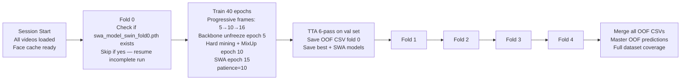

<div align="center">

# 🟠 Model 4 — Swin Transformer Tiny + DCT Frequency Branch

<p>
  
  
  
  
  
</p>

**Swin Transformer Tiny with hierarchical shifted-window attention, a pre-computed on-the-fly DCT frequency branch, pack\_padded\_sequence BiLSTM for clean gradient flow, and a full 5-fold OOF cross-validation loop in a single Kaggle session.**

</div>

---

## 📋 Table of Contents

- [Architecture Overview](#-architecture-overview)
- [Pipeline Flowchart](#-pipeline-flowchart)
- [Dataset Configuration](#-dataset-configuration)
- [Key Architectural Innovations](#-key-architectural-innovations)
- [5-Fold OOF Training Loop](#-5-fold-oof-training-loop)
- [Training Configuration](#-training-configuration)
- [Test-Time Augmentation](#-test-time-augmentation)
- [Evaluation & Metrics](#-evaluation--metrics)
- [Hyperparameter Reference](#-hyperparameter-reference)
- [Output Files](#-output-files)
- [Execution Order](#-execution-order)

---

## 🏗️ Architecture Overview

| Property | Value |
|----------|-------|
| Experiment name | `CNN_SwinTiny_BiLSTM_Attn_AllEnhancements` v1.0_swin_transformer |
| Backbone | `swin_tiny_patch4_window7_224` via timm — **768-dim** spatial features |
| Channel attention | ECA-Net on 768 channels |
| Input projection | Linear(768→384), LayerNorm, GELU, Dropout |
| Frequency branch | **On-the-fly DCT** — 128-dim from raw frame pixels |
| Temporal model | **pack\_padded\_sequence** BiLSTM, hidden=256, bidirectional → 512-dim |
| Attention | 4-head MHA with key_padding_mask |
| Fused classifier | concat(temporal 512, freq 192) = **704-dim** |
| Input resolution | 224 × 224 px (Swin-Tiny native) |
| Normalisation | ImageNet μ=[0.485,0.456,0.406] σ=[0.229,0.224,0.225] |
| Effective batch size | 8 (physical=2 × accumulation=4) |
| Loss function | Focal Loss (α=**0.5**, γ=2.0, label_smoothing=0.08) |
| Progressive frames | 5 → 10 → 16 frames (epochs 0-4 → 5-14 → 15+) |
| Hard negative mining | Epoch ≥ 10, MixUp activated |
| SWA | Epoch 15+, cosine anneal strategy over 5 epochs |
| Cross-validation | **Full 5-fold OOF in one session** |
| TTA | 6-pass per fold |
| Output | `cnn_predictions_swin_oof_MASTER.csv` — column `P_CNN` |

---

## 🗺️ Pipeline Flowchart

```mermaid
flowchart TD
    A["🎬 Input Video\n224×224 target — Swin-Tiny native\nLoaded from master_dataset_index.csv\nAll 5 folds trained in a single 11.5h session"]

    A --> B["P100 Compatibility Fix Cell 1\nIdentical to other models\ntorch==2.4.1+cu121 for SM 6.0"]

    B --> C["Environment Setup Cell 2\nPYTHONHASHSEED=42\nPYTORCH_CUDA_ALLOC_CONF=max_split_size_mb:128"]

    C --> D["Dependency Install Cell 5 — internet-safe\nfacenet-pytorch==2.6.0 --no-deps\ntimm albumentations opencv seaborn\nFallback verification if offline"]

    D --> E["Unified Data Compiler Cell 7\nCUSTOM_BASE = datasets/likhithvasireddy/400videoseach/...\nDFDC_DIR = datasets/swapnavasireddy/dfdc-sample-videos\nBug fix Bug 8: n_capped = min(len(dfdc_real), MAX_PER_CLASS)\n  Previously len(dfdc_real) uncapped caused real > fake\nAssert len >= 100 n_real >= 50 n_fake >= 50\nBalance via concat sample(min_n) from each class"]

    E --> F["Imports Cell 8\nSEED=42 env PYTHONHASHSEED\ncudnn.deterministic REMOVED\ncudnn.benchmark=False — P100 LSTM stability\ncv2.setNumThreads(0)\nNO transformers import — uses LambdaLR"]

    F --> G["Comprehensive Preflight Cell 9\n11 CUDA operations same as others\nModel loading test for swin_tiny_patch4_window7_224\n_MODEL_NAME defined locally to avoid NameError Bug 7\nGPU forward pass verification"]

    G --> H["Configuration Cell 10\nFOCAL_ALPHA=0.5 Bug fix from 0.75\n  0.75 gave fake 3x weight — biased toward fake\nHIDDEN_DIM=192 — different from others which use 256\nDROP_PATH_RATE=0.2 — explicit for Swin\nSWA_LR=1e-5 — smaller than Xception 5e-5\nPATIENCE=10 — shorter than EfficientNet 25 Xception 25\nCURRENT_FOLD = int(os.environ.get('FOLD', 0))\n  Dynamic fold selection from environment variable\nUSE_PROGRESSIVE_FRAMES=True — kept unlike Xception\nNo Auto-Resume Magic in Swin — fold completion detection instead"]

    H --> I["MTCNN + Eye-Landmark Alignment Cell 12\nIdentical to Xception\nBlur threshold=20.0 Bug fix from 5.0\n  5.0 was near-zero and effectively disabled\n  20.0 meaningfully rejects blurry faces"]

    I --> J["Frame Extraction Cell 13\nBug fix Bug 6: np.unique(np.linspace(...))\n  Removes duplicates when total < n_frames\nindex_set for O(1) lookup\nBreak as soon as all unique indices collected\n  Prevents full-video sequential read for short clips"]

    J --> K["Load Videos from Master CSV Cell 14\nload_videos_from_csv\nVerify required columns\nRemove missing paths"]

    K --> L["Face Extraction Cell 15\nPRECOMPUTED_CACHE_INDEX = datasets/swapnavasireddy/swin-1data-cache/cache_index.json\nPRECOMPUTED_CACHE_DIR = datasets/swapnavasireddy/swin-1data-cache/face_cache\nIf found: remap all paths old → new location\nIf not found: extract_and_cache_faces n_frames=16\nSave cache_index.json for recovery"]

    L --> M["Verify Cache Cell 16\nStale cache detection: shape != IMG_SIZE raises ValueError\nReport cached files count and total GB"]

    M --> N["Free GPU Memory Cell 17\nDelete face_extractor\ngc collect + cuda empty_cache + synchronize"]

    N --> O["Cell 19 — MAIN TRAINING CELL — ALL 5 FOLDS\nThis is the largest cell in the notebook\nContains ALL class definitions AND training loop\nRuns sequentially fold 0 → 1 → 2 → 3 → 4 in one session"]

    O --> O1["Model Classes Defined Inside Cell 19\nBug fix Bug 1: model classes were completely missing from earlier versions\nEfficientChannelAttention — ECA-Net\nSpatioTemporalSwinCNN — full architecture"]

    O1 --> O2["SpatioTemporalSwinCNN Architecture\nDCT matrix: 64×64 pre-computed as register_buffer\nImageNet mean/std as register_buffer\nNo allocation overhead in forward pass"]

    O2 --> O3["Backbone: swin_tiny_patch4_window7_224\ntimm pretrained=True global_pool=avg\ndrop_path_rate=0.2 → 768-dim output\nNote: Swin uses shifted window self-attention\nnot standard global attention\nPatch size=4 Window size=7 → 49 patches final stage"]

    O2 --> O4["ECA Channel Attention on 768d\nk = odd(ceil((log2(768)+1)/2)) = odd(5) = 5\nConv1d(1,1,kernel_size=5,padding=2)\nApplied AFTER backbone — re-weights 768 channels\nNote: backbone is 3D input so reshape B*T,768 needed"]

    O2 --> O5["Input Projection\nLinear(768→384) LayerNorm GELU Dropout(0.15)\nDropped to HIDDEN_DIM*2=384\nnot 512 like other models because HIDDEN_DIM=192"]

    O2 --> O6["DCT Frequency Branch — On-the-Fly\nDCT matrix registered as buffer — O(1) forward\nRGB → grayscale: 0.299R + 0.587G + 0.114B\nResize to 64×64 via bilinear interpolation\n2D DCT via matmul(dct_m, down, dct_m.T)\n8×8 block decomposition → 64 blocks\nmeans + stds per block = 128-dim\nlog(|DCT| + 1e-6) normalisation\nLinear(128→192) LayerNorm GELU Dropout(0.15)\nLinear(192→192) LayerNorm\nMasked average pool → freq_pooled 192-dim\nNote: 192-dim NOT 256-dim like Xception freq branch"]

    O2 --> O7["Skip Padded Frames in Backbone\nBug fix Bug 2 from original audit\nreal_mask_flat = mask.view(-1)\nreal_spatial = backbone(x_flat[real_mask_flat])\nspatial_flat = zeros(B*T, 768)\nspatial_flat[real_mask_flat] = real_spatial\nPadding positions get zero features\nPrevents padding from polluting backbone BN stats"]

    O2 --> O8["pack_padded_sequence BiLSTM\nlengths = mask.sum(dim=1).clamp(min=1)\npacked = pack_padded_sequence(projected, lengths, enforce_sorted=False)\nLSTM: input=384 hidden=256 layers=2 bidirectional → 512-dim\nwith torch.backends.cudnn.flags(enabled=False)\npad_packed_sequence(total_length=T)\nXavier init input weights\nOrthogonal init hidden weights\nForget-gate bias = 1.0 LSTM best practice\nTemporalDropout p=0.3 after LSTM"]

    O2 --> O9["Multi-Head Attention\n4 heads embed=512 key_padding_mask=~mask\nResidual + LayerNorm → masked avg-pool → temporal_pooled 512-dim"]

    O2 --> O10["Fused Classifier 704-dim\nconcat(temporal_pooled 512, freq_pooled 192) = 704\nLinear(704→192) LayerNorm GELU Dropout(0.3)\nLinear(192→96) LayerNorm GELU Dropout(0.15)\nLinear(96→1)\nNote: 704=512+192 vs Xception 768=512+256"]

    O3 & O4 & O5 & O6 & O7 & O8 & O9 & O10 --> P

    P["For fold in range(5)\nFold completion detection: skip if swa_model_swin_foldN.pth exists\nCreate fresh model + optimizer + scheduler per fold\nIdentity-aware split: StratifiedGroupKFold per fold\nDataset creation with progressive frames curriculum"]

    P --> P1["Per-Fold Optimiser\n4 param groups:\nbackbone_decay backbone_nodecay\nother_decay other_nodecay\nSeparated to apply weight decay only to non-bias-non-norm params"]

    P --> P2["Per-Fold Scheduler LambdaLR\nlinear warmup to SWA_START\neta_min=0.1*LR — never reach zero\nStepped per epoch"]

    P --> P3["Per-Fold SWA\nAveragedModel(model)\nSWA-LR anneal_strategy=cos anneal_epochs=5\n4 per-group SWA-LRs matching param_groups\nSWA starts epoch 15"]

    P --> P4["Per-Epoch Training\nProgressiveFrames: 5 → 10 → 16 epochs 0-4 5-14 15+\nVal dataset stays at full 16 frames always\nMixUp: torch.roll lam~Beta(0.4,0.4) epoch >= 10\nGrad accumulation 4 steps\nGrad clip max_norm=1.0\nBackbone unfreeze epoch 5 → LR/100 ramp → LR/10\nMid-epoch autosave every 50 steps\nSession time limit check per epoch"]

    P --> P5["Per-Fold Checkpoints\nbest_model_swin_foldN.pth — best by AUC\nswa_model_swin_foldN.pth — SWA averaged\n_last_model kept alive — fallback if no checkpoint\n_last_val_dataset kept alive — SWA BN update"]

    P --> P6["Per-Fold OOF Predictions\n6-pass TTA over val_videos for this fold\ncnn_predictions_swin_oof_foldN.csv\nColumns: video_id label P_CNN prediction source fold"]

    P1 & P2 & P3 & P4 & P5 & P6 --> Q

    Q["Load Best Model Cell 20\nPick fold with highest AUC from all_fold_results\nFallback: scan OOF CSVs compute AUC rank\nFallback: _last_model if no checkpoint found\nRebuild SpatioTemporalSwinCNN pretrained=False\nLoad weights from swa_model_swin_foldN.pth\nOr best_model_swin_foldN.pth if SWA not saved"]

    Q --> R["Load + Merge OOF CSVs Cell 24\nglob cnn_predictions_swin_oof_fold*.csv\nConcat all folds pd.read_csv\nDrop duplicates keep=last\nSave: cnn_predictions_swin_oof_MASTER.csv\nCompute combined AUC Acc F1 Prec Rec\nPer-source AUC breakdown"]

    R --> S["Bootstrap CI Cell 25\nscipy brentq + interp1d for EER computation\n5 metrics: AUC Acc F1 Prec Rec\nPlus EER as scalar (no bootstrap for EER)\nSeed=42 RandomState"]

    S --> T["Evaluation Plots Cell 26\nROC PR Confusion Matrix Score Distribution\nFallback: load from master OOF CSV if y_true missing\nclassification_report digits=4"]

    T --> U["SwinGradCAM Cell 27\nTarget: model.backbone.layers[-1].blocks[-1].norm1\nReshape 1D sequence → 2D spatial grid 7×7\nSwin-Tiny final stage: 7×7=49 patches\nInterpolate heatmap to 224×224"]

    U --> V["OUTPUT\ncnn_predictions_swin_oof_MASTER.csv\nvideo_id · label · P_CNN · fold · source\nIndividual per-fold CSVs also preserved\nbest_model_swin_foldN.pth × 5 folds\nswa_model_swin_foldN.pth × 5 folds\nevaluation_swin_foldX.png"]

    style A fill:#fff3e0,stroke:#e65100,color:#bf360c
    style O fill:#e65100,stroke:#bf360c,color:#fff
    style O1 fill:#e65100,stroke:#bf360c,color:#fff
    style O7 fill:#f57c00,stroke:#bf360c,color:#fff
    style O8 fill:#f57c00,stroke:#bf360c,color:#fff
    style O10 fill:#bf360c,stroke:#7f0000,color:#fff
    style P fill:#bf360c,stroke:#7f0000,color:#fff
    style V fill:#7f0000,stroke:#400000,color:#fff
```



---

## 📊 Dataset Configuration

All datasets loaded via **Unified Data Compiler** (Cell 7).

| Source | Kaggle Path | Label | Max |
|--------|-------------|-------|-----|
| FaceForensics++ Real | `datasets/xdxd003/ff-c23/FaceForensics++_C23/original` | 0 | 200 |
| FF++ Deepfakes | `.../Deepfakes` | 1 | 200 |
| FF++ Face2Face | `.../Face2Face` | 1 | 200 |
| FF++ FaceSwap | `.../FaceSwap` | 1 | 200 |
| FF++ NeuralTextures | `.../NeuralTextures` | 1 | 200 |
| FF++ FaceShifter | `.../FaceShifter` | 1 | 200 |
| FF++ DeepFakeDetection | `.../DeepFakeDetection` | 1 | 200 |
| Celeb-DF Real | `datasets/reubensuju/celeb-df-v2/Celeb-real` | 0 | 150 |
| YouTube Real | `datasets/reubensuju/celeb-df-v2/YouTube-real` | 0 | 50 |
| Celeb-DF Fake | `datasets/reubensuju/celeb-df-v2/Celeb-synthesis` | 1 | 200 |
| **Custom Real** | `datasets/likhithvasireddy/400videoseach/.../real_videos` | 0 | 400 |
| **Custom Fake** | `datasets/likhithvasireddy/400videoseach/.../deepfake_videos` | 1 | 400 |
| DFDC | `datasets/swapnavasireddy/dfdc-sample-videos` + `metadata.json` | 0/1 | Balanced |

> **Dataset path note:** Swin uses `likhithvasireddy/400videoseach` (same as rPPG) but `swapnavasireddy/dfdc-sample-videos` (with **s** plural, unlike rPPG's singular `dfdc-sample-video`).

### Pre-extracted Cache

```python
PRECOMPUTED_CACHE_INDEX = "/kaggle/input/datasets/swapnavasireddy/swin-1data-cache/cache_index.json"
PRECOMPUTED_CACHE_DIR   = "/kaggle/input/datasets/swapnavasireddy/swin-1data-cache/face_cache"
# Path remapping: /kaggle/working/face_cache/ → new input location
```

---

## 🔬 Key Architectural Innovations

### 1. Pre-computed DCT Matrix as Buffer

```python
# Computed ONCE at model initialisation — never recomputed during training
dct_m = np.empty((64, 64))
for k in range(64):
    for n in range(64):
        dct_m[k, n] = math.cos(math.pi * k * (2.0 * n + 1) / 128.0)
dct_m[0, :] /= math.sqrt(2.0)
dct_m *= math.sqrt(2.0 / 64)
self.register_buffer('dct_m', torch.from_numpy(dct_m).float())
# Also: ImageNet mean/std as buffers for denormalisation in DCT branch
self.register_buffer('imagenet_mean', torch.tensor([0.485, 0.456, 0.406]).view(1,3,1,1))
self.register_buffer('imagenet_std',  torch.tensor([0.229, 0.224, 0.225]).view(1,3,1,1))
```

### 2. On-the-Fly DCT Feature Extraction

```python
def _rgb_to_dct_features(self, x):
    """Extract 128-dim DCT features from normalised frame tensor."""
    # Denormalise: x * std + mean → [0,1] range
    x_denorm = x * self.imagenet_std + self.imagenet_mean
    # Grayscale conversion: ITU-R BT.601 coefficients
    gray = 0.299 * x_denorm[:, 0] + 0.587 * x_denorm[:, 1] + 0.114 * x_denorm[:, 2]
    # Bilinear downsample to 64×64
    down = F.interpolate(gray.unsqueeze(1), size=(64,64), mode='bilinear', align_corners=False).squeeze(1)
    # 2D DCT via pre-computed matrix: DCT_m @ image @ DCT_m^T
    dct_feat = torch.matmul(torch.matmul(self.dct_m, down), self.dct_m.t())
    # Log-magnitude normalisation
    dct_feat = torch.log(torch.abs(dct_feat) + 1e-6)
    # Extract 8×8 block statistics: 64 blocks × (mean + std) = 128-dim
    blocks = dct_feat.unfold(1, 8, 8).unfold(2, 8, 8)
    means = blocks.mean(dim=(3,4)).reshape(x.size(0), 64)
    stds  = blocks.std(dim=(3,4)).reshape(x.size(0), 64)
    return torch.cat([means, stds], dim=1)  # (B*T, 128)
```

### 3. Skip Padded Frames in Backbone

```python
if mask is not None:
    real_mask_flat = mask.view(-1)           # (B*T,) bool
    real_spatial = self.backbone(x_flat[real_mask_flat])  # Only real frames
    spatial_flat = torch.zeros(B*T, 768, device=x.device, dtype=real_spatial.dtype)
    spatial_flat[real_mask_flat] = real_spatial   # Zero-fill padding positions
    spatial = spatial_flat.view(B, T, -1)
else:
    spatial = self.backbone(x_flat).view(B, T, -1)
```

### 4. pack\_padded\_sequence BiLSTM

```python
# Eliminates padding corruption in LSTM gradient flow
lengths = mask.sum(dim=1).clamp(min=1)   # Per-sample real frame counts
packed  = pack_padded_sequence(projected, lengths.cpu(), batch_first=True, enforce_sorted=False)
with torch.backends.cudnn.flags(enabled=False):
    packed_out, _ = self.temporal(packed)
lstm_out, _ = pad_packed_sequence(packed_out, batch_first=True, total_length=T)
```

### 5. LSTM Weight Initialisation

```python
for param_name, param in module.named_parameters():
    if 'weight_ih' in param_name:
        nn.init.xavier_uniform_(param.data)      # Input-hidden: Xavier
    elif 'weight_hh' in param_name:
        nn.init.orthogonal_(param.data)           # Hidden-hidden: Orthogonal
    elif 'bias' in param_name:
        nn.init.zeros_(param.data)
        n = param.data.size(0)
        param.data[n // 4 : n // 2].fill_(1.0)  # Forget-gate bias = 1.0
# Forget-gate bias=1 prevents vanishing gradients early in training
```

### 6. Fold Completion Detection

```python
swa_path = os.path.join(cfg.OUTPUT_DIR, f"swa_model_swin_fold{fold_n}.pth")
if os.path.exists(swa_path):
    print(f"  ✓ Fold {fold_n+1} already complete — skipping")
    # Load OOF predictions from disk if CSV exists
    continue
```

---

## 🏋️ 5-Fold OOF Training Loop

The entire 5-fold cross-validation loop runs inside **one cell (Cell 19)** in a single Kaggle session (~11.5 hours).



### Session Safety Mechanisms

- **Mid-epoch autosave:** Every 50 batches saves `{name}_epoch{e}_step{s}_fold{f}.pth`
- **Session time limit check:** Graceful exit if approaching 11.5h boundary
- **`_last_model` alive:** Last epoch model kept in memory as fallback
- **`_last_val_dataset` alive:** Needed for SWA BN stats update without reconstruction

---

## 🏋️ Training Configuration

### 4 Param Groups (vs 9 in Xception)

```python
param_groups = [
    {'params': [p for n,p in model.named_parameters() if 'backbone' in n and p.requires_grad and p.dim() >= 2],
     'lr': LEARNING_RATE/10, 'weight_decay': WEIGHT_DECAY,  'name': 'backbone_decay'},
    {'params': [p for n,p in model.named_parameters() if 'backbone' in n and p.requires_grad and p.dim() < 2],
     'lr': LEARNING_RATE/10, 'weight_decay': 0.0,            'name': 'backbone_nodecay'},
    {'params': [p for n,p in model.named_parameters() if 'backbone' not in n and p.requires_grad and p.dim() >= 2],
     'lr': LEARNING_RATE,    'weight_decay': WEIGHT_DECAY,   'name': 'other_decay'},
    {'params': [p for n,p in model.named_parameters() if 'backbone' not in n and p.requires_grad and p.dim() < 2],
     'lr': LEARNING_RATE,    'weight_decay': 0.0,             'name': 'other_nodecay'},
]
# AdamW(param_groups) — weight decay only applied to 2D+ tensors (matrices)
# Bias and LayerNorm params (dim < 2) get weight_decay=0
```

### Scheduler — LambdaLR

```python
def lr_lambda(epoch):
    if epoch < SWA_START:
        # Linear warmup to SWA_START with eta_min=0.1
        return max(0.1, 1.0 - epoch / SWA_START * (1.0 - 0.1))
    else:
        return 0.1  # Constant at eta_min after SWA starts
scheduler = torch.optim.lr_scheduler.LambdaLR(optimizer, lr_lambda=lr_lambda)
# Stepped per epoch (not per step)
```

### SWA

```python
swa_model = AveragedModel(model)
swa_scheduler = SWALR(optimizer,
    swa_lr=[g['lr'] * 0.1 for g in param_groups],  # Per-group SWA-LR
    anneal_epochs=5, anneal_strategy='cos')
# NOTE: Per-group SWA-LRs preserved backbone/head ratio
# vs Xception which used scalar (different design decision)
```

### Progressive Frames Curriculum

| Epoch Range | Frames per Video | Purpose |
|-------------|-----------------|---------|
| 0 – 4 | 5 | Fast convergence on easy temporal patterns |
| 5 – 14 | 10 | Gradually increase temporal complexity |
| 15 – 40 | 16 | Full sequence for SWA phase |

> **Validation set always uses 16 frames** — only train dataset changes. This ensures consistent validation AUC comparison across epochs.

---

## 🎨 Data Augmentation

Swin uses **ImageNet normalisation** (same as EfficientNet, unlike Xception's [-1,1]).

```python
# Training transforms
A.HorizontalFlip(p=0.5)
A.ShiftScaleRotate(shift_limit=0.05, scale_limit=0.05, rotate_limit=10, p=0.3)
A.RandomBrightnessContrast(brightness_limit=0.2, contrast_limit=0.2, p=0.5)
A.HueSaturationValue(hue_shift_limit=10, sat_shift_limit=20, val_shift_limit=15, p=0.3)
A.RGBShift(r_shift_limit=15, g_shift_limit=15, b_shift_limit=15, p=0.3)
A.ImageCompression(quality_range=(75, 100), p=0.2)    # Lighter than Xception
A.GaussNoise(std_range=(0.02, 0.1), p=0.3)
A.CoarseDropout(num_holes_range=(1,4), hole_height_range=(8,32), hole_width_range=(8,32), p=0.3)
A.Posterize(num_bits=4, p=0.1)
A.Normalize(mean=[0.485, 0.456, 0.406], std=[0.229, 0.224, 0.225])
SafeToTensor()   # torch.tensor not from_numpy
```

### MixUp in Swin

```python
# MIXUP_ALPHA = 0.4 — stronger than Xception's 0.2
lam = np.random.beta(0.4, 0.4) if MIXUP_ALPHA > 0 else 1.0
idx = torch.roll(torch.arange(B), shifts=1).to(device)
mixed = lam * frames + (1 - lam) * frames[idx, :]
# No CutMix in Swin (unlike Xception which has 50/50 alternation)
```

---

## 🔁 Test-Time Augmentation — 6 Passes Per Fold

```python
# 6-pass TTA applied to val_videos at end of EACH fold
# Same 6 passes as Xception: standard, flip, bright+, bright−, blur, 93% crop
# All TTA predictions written to per-fold OOF CSV
# Final master CSV: concat of all folds, deduplication on video_id
```

---

## 📊 Evaluation & Metrics

### OOF Metric Computation

```python
# After ALL folds complete:
oof_csv_paths = glob.glob(os.path.join(cfg.OUTPUT_DIR, "cnn_predictions_swin_oof_fold*.csv"))
tta_df = pd.concat([pd.read_csv(p) for p in oof_csv_paths], ignore_index=True)
tta_df = tta_df.drop_duplicates(subset='video_id', keep='last')
master_path = os.path.join(cfg.OUTPUT_DIR, "cnn_predictions_swin_oof_MASTER.csv")
tta_df.to_csv(master_path, index=False)
```

### Bootstrap CI

```python
# scipy brentq + interp1d for EER (not compute_eer like others)
fpr, tpr, _ = roc_curve(y_true, y_prob)
eer = brentq(lambda x: 1.0 - x - interp1d(fpr, tpr)(x), 0., 1.)
```

### Swin Grad-CAM

```python
class SwinGradCAM:
    # Target: model.backbone.layers[-1].blocks[-1].norm1
    # Swin-Tiny final stage: sequence of (B*T, 49, 768)
    # Reshape 1D sequence → 2D spatial: 49 patches → 7×7
    # Interpolate to 224×224 for visualisation
```

---

## ⚙️ Hyperparameter Reference

| Parameter | Value | Notes |
|-----------|-------|-------|
| `EXPERIMENT_NAME` | `CNN_SwinTiny_BiLSTM_Attn_AllEnhancements` | Config |
| `MODEL_NAME` | `swin_tiny_patch4_window7_224` | Swin-Tiny config |
| `IMG_SIZE` | 224 | Swin-Tiny native |
| `DROP_PATH_RATE` | 0.2 | Swin stochastic depth |
| `FRAMES_PER_VIDEO` | 16 | Full sequence |
| `BATCH_SIZE` | 2 | Physical |
| `GRAD_ACCUMULATION_STEPS` | 4 | Effective batch=8 |
| `NUM_WORKERS` | 0 | P100 |
| `NUM_EPOCHS` | 40 | Per fold |
| `LEARNING_RATE` | 1×10⁻⁴ | Same as Xception |
| `WEIGHT_DECAY` | 1×10⁻² | Same as Xception |
| `WARMUP_RATIO` | 0.1 | For LambdaLR |
| `FOCAL_ALPHA` | **0.5** | Fixed (bug fix from 0.75) |
| `FOCAL_GAMMA` | 2.0 | Standard |
| `LABEL_SMOOTHING` | 0.08 | Between EfficientNet (0.1) and Xception (0.05) |
| `DROPOUT` | 0.3 | Same as Xception |
| `HIDDEN_DIM` | **192** | Different — others use 256 |
| `LSTM_HIDDEN` | 256 | Per-direction hidden |
| `LSTM_LAYERS` | 2 | Stacked |
| `ATTENTION_HEADS` | 4 | MHA heads |
| `FREEZE_BACKBONE` | True | Unfreeze epoch 5 |
| `UNFREEZE_EPOCH` | 5 | Same as others |
| `HARD_MINING_EPOCH` | 10 | MixUp activation |
| `MIXUP_ALPHA` | **0.4** | Stronger than Xception 0.2 |
| `USE_PROGRESSIVE_FRAMES` | **True** | Different from Xception False |
| `USE_SWA` | True | Enabled |
| `SWA_START` | 15 | Same as Xception |
| `SWA_LR` | **1×10⁻⁵** | Smaller than Xception 5×10⁻⁵ |
| `K_FOLDS` | 5 | All run in one session |
| `CURRENT_FOLD` | `os.environ.get("FOLD", 0)` | Dynamic |
| `PATIENCE` | **10** | Shorter — faster iteration per fold |
| `SEED` | 42 | Global |
| Fused dim | **704** | 512 temporal + 192 freq |
| Freq feature dim | **128** | DCT block means + stds |
| Freq encoder out | **192** | hidden_dim |

---

## 📁 Output Files

| File | Location | Contents |
|------|----------|---------|
| `cnn_predictions_swin_oof_MASTER.csv` | `/kaggle/working/` | All folds merged — `video_id · label · P_CNN · fold · source` |
| `cnn_predictions_swin_oof_fold{k}.csv` | `/kaggle/working/` | Per-fold OOF predictions (k=0..4) |
| `best_model_swin_fold{k}.pth` | `/kaggle/working/` | Best checkpoint per fold |
| `swa_model_swin_fold{k}.pth` | `/kaggle/working/` | SWA model per fold |
| `evaluation_swin_fold{k}.png` | `/kaggle/working/` | ROC · PR · CM · Score dist per fold |
| `training_curves_swin_fold{last}.png` | `/kaggle/working/` | Training curves for last trained fold |
| `gradcam_swin.png` | `/kaggle/working/` | Grad-CAM heatmaps |
| `config.json` | `/kaggle/working/` | Full Config as JSON |
| `cache_index.json` | `/kaggle/working/` | `{video_id: .npy path}` |
| `face_cache/*.npy` | `/kaggle/working/face_cache/` | Per-video faces `(T, 224, 224, 3) uint8` |

---

## 🚀 Execution Order

```
Cell 1  → P100 PyTorch compatibility fix
Cell 2  → Environment variables
Cell 3  → Walk /kaggle/input directory
Cell 5  → Internet-safe dependency installation
Cell 7  → Unified data compiler → master_dataset_index.csv (likhithvasireddy paths)
Cell 8  → Imports + reproducibility (no cudnn.deterministic)
Cell 9  → Comprehensive preflight (Swin model test, bug fix for NameError)
Cell 10 → Config class (FOCAL_ALPHA=0.5 bug fix, HIDDEN_DIM=192, PATIENCE=10)
Cell 12 → FaceExtractor with eye-landmark alignment (blur threshold=20.0 fix)
Cell 13 → Frame extraction (np.unique fix for short videos)
Cell 14 → Load videos from master CSV
Cell 15 → Load pre-extracted cache (swapnavasireddy/swin-1data-cache) OR extract
Cell 16 → Verify cache (stale detection)
Cell 17 → Free GPU memory (delete MTCNN)
Cell 19 → *** MAIN CELL *** All model definitions + full 5-fold training loop
Cell 20 → Load best model (from all_fold_results or OOF CSVs)
Cell 21 → Training curves for last trained fold
Cell 23 → Comment: prediction functions defined in Cell 24 below
Cell 24 → Load + merge all OOF CSVs → master OOF → compute combined metrics
Cell 25 → Bootstrap CI (scipy brentq EER)
Cell 26 → Evaluation plots (with fallback to OOF CSV if y_true missing)
Cell 27 → SwinGradCAM (reshape 1D → 2D)
Cell 29 → Late fusion integration guide
Cell 30 → Final summary
```

---

## 📚 References

1. Liu et al., *Swin Transformer: Hierarchical Vision Transformer using Shifted Windows*, ICCV, 2021.
2. Wang et al., *ECA-Net: Efficient Channel Attention for Deep Convolutional Neural Networks*, CVPR, 2020.
3. Rossler et al., *FaceForensics++: Learning to Detect Manipulated Facial Images*, ICCV, 2019.
4. Li et al., *Celeb-DF: A Large-Scale Challenging Dataset for DeepFake Video Forensics*, CVPR, 2020.
5. Lin et al., *Focal Loss for Dense Object Detection*, ICCV, 2017.
6. Izmailov et al., *Averaging Weights Leads to Wider Optima and Better Generalisation*, UAI, 2018.

---

<div align="center">
<sub>Part of the <strong>DeepGuard</strong> multi-modal deepfake detection system · <strong>Model 4 of 4</strong> · Swin Transformer Spatio-Temporal Stream</sub>
</div>
