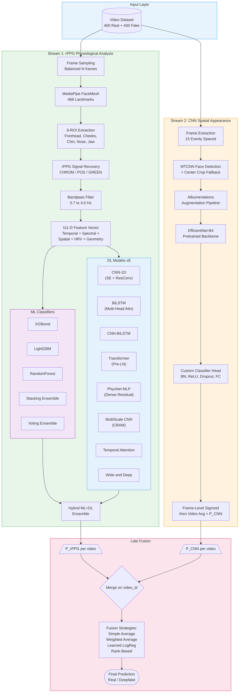
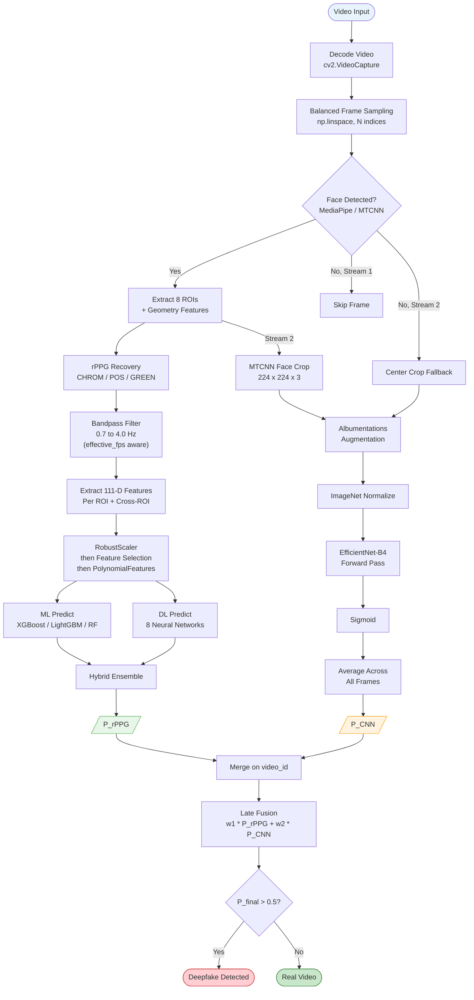
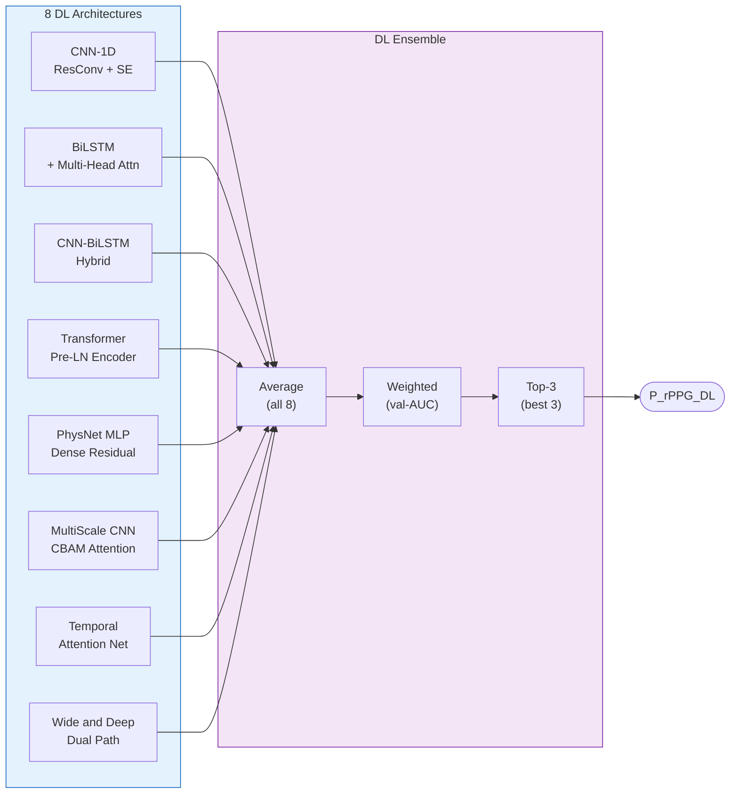
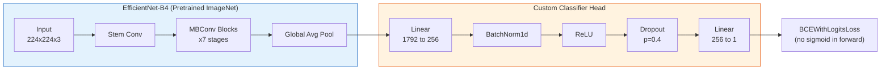

# Neuro-Pulse: Multi-Stream Deepfake Detection via rPPG & Spatial Analysis

A research-grade deepfake detection system that fuses **remote photoplethysmography (rPPG) physiological signals** with **CNN-based spatial appearance analysis** through Late Fusion. Built on the FakeCatcher methodology (Ciftci et al., TPAMI 2020) and extended with 8 deep learning architectures, 7 ML classifiers, and a hybrid ensemble framework.

> **Dataset:** 800 videos (400 real + 400 deepfake)
> **Target Platform:** Kaggle P100 GPU (16 GB VRAM)
> **Framework:** PyTorch + scikit-learn + XGBoost + LightGBM

---

## Table of Contents

- [System Architecture](#system-architecture)
- [Pipeline Flowchart](#pipeline-flowchart)
- [Stream 1: rPPG Physiological Analysis](#stream-1-rppg-physiological-analysis)
  - [Feature Extraction (111 Dimensions)](#feature-extraction-111-dimensions)
  - [ML Pipeline](#ml-pipeline)
  - [DL Pipeline](#dl-pipeline)
  - [Hybrid ML+DL Ensemble](#hybrid-mldl-ensemble)
- [Stream 2: CNN Spatial Appearance](#stream-2-cnn-spatial-appearance)
  - [Face Detection and Extraction](#face-detection-and-extraction)
  - [EfficientNet-B4 Architecture](#efficientnet-b4-architecture)
  - [Training Protocol](#training-protocol)
- [Late Fusion Integration](#late-fusion-integration)
- [Cross-Notebook Connectivity](#cross-notebook-connectivity)
- [Feature Reference](#feature-reference)
- [References](#references)

---

## System Architecture



---

## Pipeline Flowchart



---

## Stream 1: rPPG Physiological Analysis

### Core Principle

Blood volume changes beneath facial skin produce subtle color fluctuations invisible to the naked eye. Real faces exhibit coherent physiological rPPG signals; deepfakes do not replicate these biological patterns. We extract signals from **8 facial ROIs** using MediaPipe's 468-landmark FaceMesh.

### Feature Extraction (111 Dimensions)

#### ROI Map

| ROI | Landmarks | Purpose |
|-----|-----------|---------|
| Forehead | 10, 338, 297, 332, 284... | Primary pulse signal (thin skin, close to temporal artery) |
| Left Cheek | 187, 123, 116, 117, 118... | Secondary pulse signal |
| Right Cheek | 411, 352, 345, 346, 347... | Bilateral symmetry check |
| Chin | 152, 148, 176, 149, 150... | Peripheral pulse |
| Nose | 1, 2, 98, 327, 326... | Central reference |
| Left Forehead | 10, 109, 67, 103, 54... | Spatial pulse distribution |
| Right Forehead | 10, 338, 297, 332, 284... | Bilateral forehead check |
| Left Jaw / Right Jaw | Distinct landmark sets | Jaw contour pulse |

#### Feature Categories

| Category | Count | Example Features | Deepfake Indicator |
|----------|-------|------------------|-------------------|
| **Per-ROI Signal (FH + LC)** | 24 | SNR, spectral purity, peak prominence, dominant freq, PSD power, MAD, std, kurtosis, skewness, harmonic ratio, crest factor, band power | Fake signals lack harmonic structure |
| **Geometry** | 20 | Eye distance ratio, eye aspect ratios, mouth metrics, nose-chin angle, jaw angle, face symmetry | Face swap distorts landmark geometry |
| **Cross-ROI Correlation** | 12 | Pearson correlation between all ROI pairs | Real: high bilateral correlation. Fake: breaks |
| **Spectral Coherence** | 6 | MSC between ROI pairs at dominant frequency | Real: coherent blood flow. Fake: incoherent |
| **Multi-Band Frequency** | 9 | Low / Mid / High band power + ratios for FH and LC | Fake energy concentrated in wrong bands |
| **HRV (Heart Rate Variability)** | 8 | RMSSD, SDNN, pNN50, pNN20, LF/HF ratio, total power | Fakes have zero or abnormal HRV |
| **Spatial Pulse Variance** | 6 | BPM variance, std, range, consistency, IQR across all ROIs | Fake: spatially inconsistent pulse |
| **Temporal Stability** | 5 | BPM std over time windows, SNR stability, consistency index | Fake: temporally unstable signals |
| **Phase Synchronization** | 5 | Phase diff between ROI pairs, sync mean, std, consistency | Fake: desynchronized pulse wave |
| **Signal Quality** | 4 | Energy, stationarity, entropy, complexity | Fake: high entropy, low stationarity |
| **Skin Reflection** | 4 | HSV V-channel variance (FH, LC), specular score, mean diff | Fake: uniform / abnormal reflection |
| **RGB Channel Correlation** | 2 | Green-Red and Green-Blue Pearson correlation | Real: G > B > R biological absorption |
| **Other** | 6 | BPM estimate, BPM consistency, spectral flatness, patch quality, SNR range | Complementary discriminators |
| **Total** | **111** | | |

#### rPPG Methods

| Method | Reference | Algorithm |
|--------|-----------|-----------|
| **CHROM** | de Haan and Jeanne, 2013 | Chrominance-based: projects RGB to Xf/Yf plane |
| **POS** | Wang et al., 2017 | Plane-Orthogonal-to-Skin: energy-normalized projection |
| **GREEN** | Verkruysse et al., 2008 | Raw green channel extraction |

### ML Pipeline

All ML models train on `PolynomialFeatures`-expanded data (~820 dimensions from 111 base features after top-40 selection + degree-2 interactions).

| Model | Type | Key Config |
|-------|------|------------|
| **XGBoost** | Gradient Boosting | `tree_method='gpu_hist'`, `n_estimators=500` |
| **LightGBM** | Gradient Boosting | `device='gpu'`, `num_leaves=63` |
| **RandomForest** | Bagging | `n_estimators=500`, `max_depth=15` |
| **Stacking** | Meta-Learner | XGB + LGB + RF base, LogisticRegression meta |
| **Voting** | Ensemble | Soft voting top-3 by AUC |

**Feature Engineering Pipeline:**
```
111 raw features
  -> RobustScaler (outlier-resistant normalization)
  -> SelectKBest (top 40 by mutual information)
  -> PolynomialFeatures (degree=2, interaction_only=True)
  -> ~820 expanded features
  -> Model training with 3-fold stratified CV
```

### DL Pipeline

8 neural network architectures, all trained with:
- **Label Smoothing** (epsilon=0.1) with class weights
- **Focal Loss** option for hard-example mining
- **Mixed Precision** (AMP) for P100 speed
- **CosineAnnealingLR** scheduler
- **Early Stopping** (patience=7)

| Model | Architecture | Key Innovation |
|-------|-------------|----------------|
| **CNN-1D** | 3x ResConvBlock + SE attention | Squeeze-Excitation channel attention on 1D rPPG features |
| **BiLSTM-Attention** | 3-layer BiLSTM + Multi-Head Attention | Captures temporal dependencies with 4-head self-attention |
| **CNN-BiLSTM** | TemporalConv then BiLSTM then FC | Combines local patterns (CNN) with sequential memory (LSTM) |
| **Transformer** | Pre-LN Transformer encoder + positional encoding | Self-attention over feature subsequences |
| **PhysNet MLP** | 5x DenseResidual + Bottleneck blocks | Deep residual MLP inspired by PhysNet architecture |
| **MultiScale CNN** | 3 parallel kernel sizes + CBAM attention | Multi-resolution feature capture with channel+spatial attention |
| **Temporal Attention** | SE then Multi-Head Attention then FC | Direct attention over raw feature dimensions |
| **Wide and Deep** | Wide path (linear) + Deep path (4-layer MLP) | Captures both memorization and generalization |



### Hybrid ML+DL Ensemble

Four fusion strategies combining ML and DL predictions:

| Method | Strategy |
|--------|----------|
| **Simple Average** | Unweighted mean of all model probabilities |
| **AUC-Weighted Average** | Weight each model by its validation AUC |
| **Meta-Learner Stacking** | Train LogisticRegression on [ML probs + DL probs + original features] |
| **Rank-Based Ensemble** | Rank-normalize probabilities before averaging (scale-robust) |

---

## Stream 2: CNN Spatial Appearance

### Face Detection and Extraction

```
Video -> 15 evenly-spaced frames -> MTCNN face detection -> 224x224 face crops
                                          | (fallback)
                                     Center crop + resize
```

| Component | Configuration |
|-----------|--------------|
| **Detector** | MTCNN (facenet-pytorch) |
| **Face size** | 224 x 224 px, margin=40 |
| **Min face** | 60 px |
| **Thresholds** | [0.6, 0.7, 0.7] (P-Net, R-Net, O-Net) |
| **post_process** | False (raw [0, 255] pixels, no [-1, 1] normalization) |
| **Frames/video** | 15 (evenly spaced via np.linspace) |
| **Min valid faces** | 3 per video |

### EfficientNet-B4 Architecture



**Model Definition:**

```python
class DeepfakeCNN(nn.Module):
    def __init__(self, model_name='efficientnet_b4', hidden_dim=256, dropout=0.4):
        super().__init__()
        # Pretrained backbone (ImageNet weights, classifier head removed)
        self.backbone = timm.create_model(
            model_name, pretrained=True, num_classes=0, global_pool='avg'
        )
        backbone_dim = self.backbone.num_features  # 1792 for EfficientNet-B4

        # Custom classifier head
        self.classifier = nn.Sequential(
            nn.Linear(backbone_dim, hidden_dim),  # 1792 -> 256
            nn.BatchNorm1d(hidden_dim),
            nn.ReLU(inplace=True),
            nn.Dropout(dropout),
            nn.Linear(hidden_dim, 1),  # Binary output (no sigmoid)
        )

    def forward(self, x):
        features = self.backbone(x)        # (B, 1792)
        logits = self.classifier(features)  # (B, 1)
        return logits.squeeze(-1)           # (B,)
```

### Training Protocol

| Parameter | Value |
|-----------|-------|
| **Optimizer** | AdamW (lr=1e-4, weight_decay=0.01) |
| **Scheduler** | CosineAnnealingLR (T_max=15, eta_min=1e-6) |
| **Loss** | BCEWithLogitsLoss |
| **Precision** | Mixed (AMP with GradScaler) |
| **Gradient Clipping** | max_norm=1.0 |
| **Batch Size** | 32 |
| **Epochs** | 15 (with early stopping, patience=5) |
| **Split** | 80/20 stratified (random_state=42) |

#### Data Augmentation (Albumentations)

| Augmentation | Probability | Parameters |
|-------------|-------------|------------|
| HorizontalFlip | 0.5 | -- |
| ShiftScaleRotate | 0.3 | shift=0.05, scale=0.05, rotate=10 degrees |
| RandomBrightnessContrast | 0.5 | brightness +/-0.2, contrast +/-0.2 |
| HueSaturationValue | 0.3 | hue +/-10, sat +/-20, val +/-15 |
| ImageCompression | 0.5 | JPEG quality 50-100 |
| GaussNoise | 0.3 | variance 10-50 |
| GaussianBlur | 0.2 | kernel 3-5 |
| CoarseDropout | 0.2 | 4 holes, 20x20 px max |
| Normalize | 1.0 | ImageNet mean/std |

#### Video-Level Inference

```
Per video:
  For each of 15 face crops:
    Apply val_transforms (normalize only)
    Forward pass -> logit -> sigmoid(logit) = p_frame
  P_CNN = mean(p_frame_1, p_frame_2, ..., p_frame_15)
```

---

## Late Fusion Integration

Both streams export a CSV with identical structure, enabling clean merging:

| File | Columns | Join Key |
|------|---------|----------|
| `rppg_predictions.csv` | `video_id`, `true_label`, `P_rPPG` | `video_id` |
| `cnn_predictions.csv` | `video_id`, `true_label`, `P_CNN` | `video_id` |

```python
import pandas as pd

# Load both streams
cnn_df  = pd.read_csv('cnn_predictions.csv')
rppg_df = pd.read_csv('rppg_predictions.csv')
fused   = cnn_df.merge(rppg_df, on='video_id')

# Strategy 1: Simple average
fused['P_final'] = (fused['P_CNN'] + fused['P_rPPG']) / 2

# Strategy 2: Weighted average
fused['P_final'] = 0.6 * fused['P_CNN'] + 0.4 * fused['P_rPPG']

# Strategy 3: Learned fusion (strongest)
from sklearn.linear_model import LogisticRegression
X_fuse = fused[['P_CNN', 'P_rPPG']].values
y_fuse = fused['true_label'].values
fusion_model = LogisticRegression().fit(X_fuse, y_fuse)
fused['P_final'] = fusion_model.predict_proba(X_fuse)[:, 1]

# Final decision
fused['prediction'] = (fused['P_final'] > 0.5).astype(int)
```

---

## Cross-Notebook Connectivity

These design decisions ensure the two notebooks produce **perfectly aligned** outputs:

| Alignment Point | rPPG Notebook | CNN Notebook | Status |
|----------------|---------------|--------------|--------|
| Video ordering | `sorted(glob.glob(...))` | `sorted(os.listdir(...))` | Alphabetical match |
| video_id format | `os.path.basename(path)` = filename | Raw filename from listdir | Identical strings |
| Split seed | `random_state=42` | `random_state=42` | Same RNG sequence |
| Split method | `train_test_split(X, y, stratify=y)` | `train_test_split(videos, stratify=labels)` | Single stratified split |
| Split ratio | `test_size=0.2` | `train_size=0.8` | Same 80/20 boundary |
| Export columns | `video_id, true_label, P_rPPG` | `video_id, true_label, P_CNN` | Merge-ready |
| Label encoding | 0 = Real, 1 = Fake | 0 = Real, 1 = Fake | Consistent |

---

## Feature Reference

<details>
<summary><strong>All 111 rPPG Features (click to expand)</strong></summary>

### Per-ROI Features (Forehead x 12 + Left Cheek x 12 = 24)
```
fh_snr, fh_spectral_purity, fh_peak_prominence, fh_dominant_freq,
fh_psd_power, fh_mad, fh_std, fh_kurtosis, fh_skewness,
fh_harmonic_ratio, fh_band_power, fh_crest_factor

lc_snr, lc_spectral_purity, lc_peak_prominence, lc_dominant_freq,
lc_psd_power, lc_mad, lc_std, lc_kurtosis, lc_skewness,
lc_harmonic_ratio, lc_band_power, lc_crest_factor
```

### Cross-ROI Correlation (12)
```
corr_fh_lc, corr_fh_rc, corr_lc_rc, corr_fh_nose, corr_fh_chin,
corr_fh_lf, corr_fh_rf, corr_lc_chin, corr_rc_chin, corr_lf_rf,
corr_nose_chin, corr_lj_rj
```

### Spectral Coherence (6)
```
coherence_fh_lc, coherence_fh_rc, coherence_lc_rc,
coherence_fh_chin, coherence_lc_chin, coherence_lj_rj
```

### Multi-Band Frequency (9)
```
band_power_low_fh, band_power_mid_fh, band_power_high_fh,
band_power_low_lc, band_power_mid_lc, band_power_high_lc,
band_ratio_low_high, band_ratio_mid_high, band_power_variance
```

### HRV Features (8)
```
hrv_rmssd, hrv_sdnn, hrv_pnn50, hrv_pnn20,
hrv_lf_power, hrv_hf_power, hrv_lf_hf_ratio, hrv_total_power
```

### Spatial Pulse Variance (6)
```
bpm_estimate, bpm_consistency, bpm_variance_all_regions,
bpm_std_all_regions, bpm_range_all_regions, bpm_iqr_all_regions
```

### Temporal Stability (5)
```
temporal_bpm_std, temporal_bpm_range, temporal_snr_std,
temporal_stability_score, temporal_consistency_index
```

### Phase Synchronization (5)
```
phase_diff_fh_lc, phase_diff_fh_rc, phase_sync_mean,
phase_sync_std, phase_sync_consistency
```

### Signal Quality (4)
```
signal_energy, signal_stationarity, signal_entropy, signal_complexity
```

### Skin Reflection (4)
```
skin_reflection_variance_fh, skin_reflection_variance_lc,
specular_reflection_score, skin_reflection_mean_diff
```

### Geometry (20)
```
geo_eye_distance_ratio, geo_eye_width_ratio, geo_eye_height_ratio,
geo_left_eye_aspect, geo_right_eye_aspect, geo_eye_symmetry_score,
geo_mouth_width_ratio, geo_mouth_height_ratio, geo_mouth_aspect,
geo_nose_width_ratio, geo_nose_height_ratio, geo_nose_tip_deviation,
geo_face_width_height, geo_jaw_angle, geo_forehead_height_ratio,
geo_nose_chin_angle, geo_philtrum_ratio, geo_face_thirds_ratio,
geo_overall_symmetry_mean, geo_overall_symmetry_std
```

### Other (7)
```
crest_factor, spectral_flatness, spatial_pulse_consistency,
patch_quality_consistency, snr_std_all_regions, snr_range_all_regions,
rgb_corr_green_red, rgb_corr_green_blue
```

</details>

---

## Project Structure

```
pyVHR_rrpg_2/
├── notebooks/
│   ├── final_MODEL.ipynb            # Stream 1: rPPG feature extraction + ML + DL
│   └── CNN_SPATIAL_STREAM.ipynb     # Stream 2: CNN spatial appearance
├── README.md                        # This file
│
├── [Generated on Kaggle at /kaggle/working/]
│   ├── X_features.npy              # Raw 111-D feature matrix
│   ├── y_labels.npy                # Binary labels
│   ├── valid_paths.npy             # Video path to feature row mapping
│   ├── features.npz                # X + y bundled
│   ├── scaler.joblib               # Fitted RobustScaler
│   ├── rppg_predictions.csv        # P_rPPG per video
│   ├── cnn_predictions.csv         # P_CNN per video
│   ├── best_cnn_model.pth          # Best EfficientNet-B4 weights
│   └── *.joblib / *.pt             # All ML + DL model weights
```

---

## References

1. **FakeCatcher** — Ciftci, U.A., Demir, I., Yin, L. (2020). *FakeCatcher: Detection of Synthetic Portrait Videos using Biological Signals.* IEEE TPAMI.
2. **DeepFakesON-Phys** — Hernandez-Ortega, J., et al. (2020). *DeepFakesON-Phys: DeepFakes Detection based on Heart Rate Estimation.*
3. **pyVHR** — Boccignone, G., et al. (2022). *An Open Framework for Remote-PPG Methods and their Assessment.*
4. **CHROM** — de Haan, G., Jeanne, V. (2013). *Robust Pulse Rate from Chrominance-Based rPPG.* IEEE TBME.
5. **POS** — Wang, W., et al. (2017). *Algorithmic Principles of Remote-PPG.* IEEE TBME.
6. **EfficientNet** — Tan, M., Le, Q. (2019). *EfficientNet: Rethinking Model Scaling for CNNs.* ICML.
7. **MTCNN** — Zhang, K., et al. (2016). *Joint Face Detection and Alignment Using Multi-task Cascaded CNNs.* IEEE SPL.
